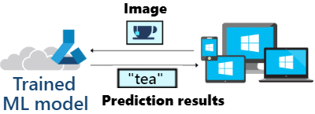
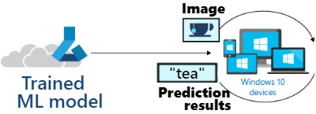
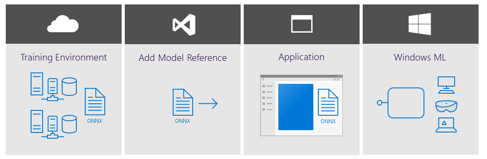

Windows Machine Learning (Windows ML) enables developers to download and use pre-trained machine learning models in Universal Windows Platform (UWP) apps across the Windows 10 device family, including laptops, PCs, Internet of Things (IoT) devices, servers, datacenters, and the HoloLens headset. 

The Windows ML API offers access to an inference engine that can perform local client-side evaluation by using machine learning models that were built and trained in the cloud. The models can perform tasks such as converting spoken audio into text, voice verification, identifying and captioning objects in photographs, extracting key information from a data set and enriching it to quickly find valuable insights, and much more. 

In this lesson, we will:

- Compare using a machine learning model locally with Windows ML to a cloud-based system
- Set up a simple UWP app with C#
- Add a pre-trained machine learning model to your app
- Load the model, bind the inputs and outputs, and use it to evaluate input
- Test the model by drawing digits into a Windows Ink Canvas to see whether the model can recognize what number we've drawn

> [!VIDEO https://www.microsoft.com/en-us/videoplayer/embed/RE2Msj5]

### Machine learning in the cloud versus on a local device (offline)

The typical approach to machine learning is:

- Gather data.
- Use that data to train a model.
- Use the model to make predictions.

The training of a model typically involves huge amounts of complex data, a ton of processing power, and a **data science degree**. [Azure Cognitive Services](https://azure.microsoft.com/en-us/services/cognitive-services/) makes that training process much simpler, offering APIs, SDKs, and services to help developers build machine learning models that power intelligent applications without having direct AI or data science skills or knowledge. 

One type of a machine learning model is an image classifier. You gather images, use those images to train the model to recognize objects (like a numerical digit), then use the model to evaluate a new image and make a prediction, or infer, what number appears in the new image. While training a model can be a difficult and expensive process without the help of a service, once the model is trained, the process of evaluation (or inference) is relatively simple.

There are two ways to use a trained machine learning model to perform evaluations:

- From the cloud by calling the model's prediction endpoint over HTTP (see the [Classify images with the Microsoft Custom Vision Service](https://docs.microsoft.com/learn/modules/classify-images-with-custom-vision-service/5-call-the-prediction-endpoint-curl) course for direction on using this method).
- Locally by downloading the model (in ONNX format) and including it in your app code to be installed and used with the Windows ML API on a Windows 10 device.

Whether or not you use a machine learning model locally, or in the cloud, depends on your use-case scenario. The following comparisons may help you determine the best choice for your needs. 

| Cloud evaluation | Local evaluation |
| :---- | :---- |
|||
| Complex processing of large amounts of data. Services like Azure Cognitive Services, offer a simple, user-friendly way to both train and evaluate models | Windows ML is built in to all Windows 10 devices and offers APIs to evaluate models offline. Available to both Win32 and UWP apps (C#, C++, JS) |
| Backup and restore can be initiated from anywhere, using any device, without the risk of data-loss from a damaged machine | Increased flexibility by removing concerns of connectivity, bandwidth, and data privacy |
| May require waiting for large amounts of data to make a roundtrip to the cloud and back | Able to respond quickly, processing an evaluation directly on the device in real time (a DirectX 12 GPU can be used for hardware acceleration, making evaluation even faster) |
| Continuous training of models, growing smarter over time | Reduced operational costs (not paying for internet bandwidth and cloud storage) |
| May be blocked by privacy or regulatory concerns (think healthcare data / HIPAA) | Private and secure (sensitive patient data can be kept on the local device) |  

