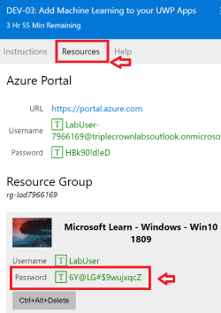
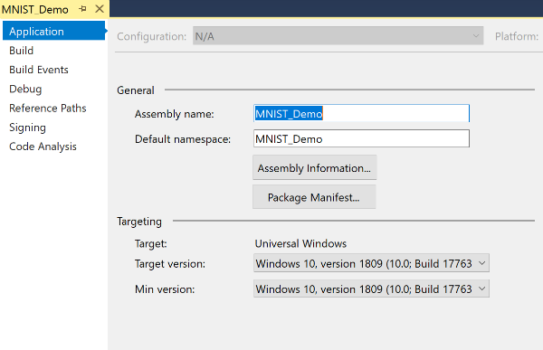
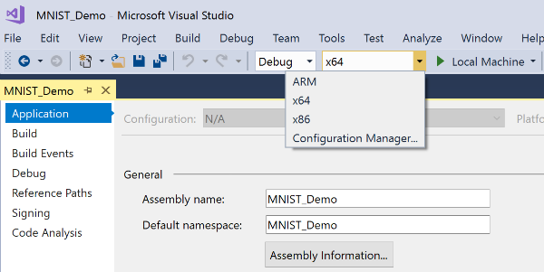
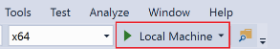
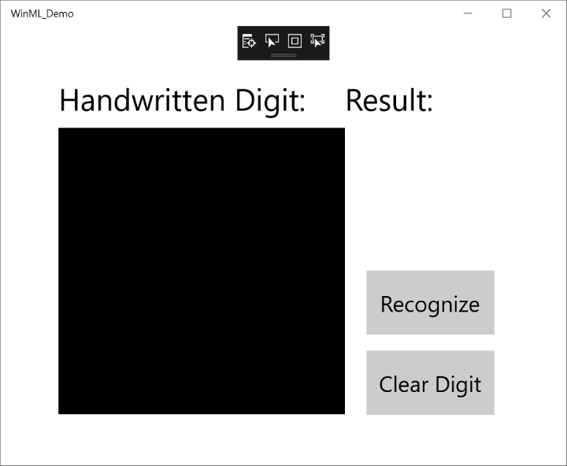
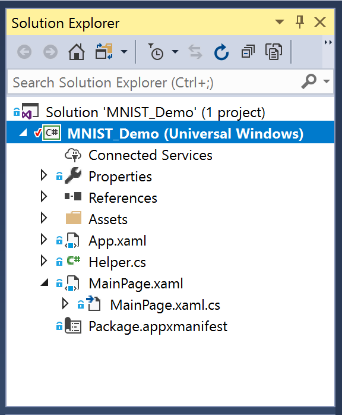

> [!NOTE]
> When the VM lab environment launches, you will see a "LabUser" profile that asks for a password. To log-in, select the "Resources" tab above the instructions, then click on the "Microsoft Learn - Windows - Win10 1809" password and it will auto-populate in your log-in screen. Select the submit button and return to the "Instructions" tab. 
> 

For this course, we've provided a UWP C# template app for you to use. The template already has XAML controls and events implemented, including:

- An InkCanvas to draw a numeric digit.
- Buttons to interpret the digit and clear the canvas.
- Helper routines to convert the InkCanvas output to a VideoFrame.

> [!VIDEO https://www.microsoft.com/en-us/videoplayer/embed/RE2Msj4]

### Open the UWP app template with Visual Studio
1) The UWP app template is located in the "Windows Learn" folder on the desktop of your sandboxed Windows 10 environment.  
 
Inside the "Windows Learn" folder, open the **Machine-Learning** folder, and then the **Add_Machine_Learning_to_your_UWP_App** folder. Here you will find the **MNIST_Demo.sln** project solution file. Double-click to open it with Visual Studio inside the sandbox. 

2) Once the Visual Studio project solution has launched, open the **Properties** window by selecting **Alt+Enter**. 
 
On the **Application** tab, you will need to check that the **Target version** and **Min version** are set to match your Windows 10 OS and SDK. Both should be set to **"Windows 10, version 1809 (10.0; Build 17763)"**. Using an earlier version of Windows will not work as the required Windows ML API was not yet supported. Changing these properties requires the project solution to be closed and reopened.
  

3) In the Visual Studio toolbar, ensure that the Solution Platform is set to x64 or x86 in order to run the project on your local machine. (Packages will not run under the ARM platform).
  

4) Now let's try running the sample app project. Click the **Start Debugging** button on the toolbar, or press **F5**. 
  

 
The application should build and launch, showing an **InkCanvas** where you can write a digit (with your finger on a touch screen, a mouse, or a Surface Pen), a **Recognize** button to interpret the number, an empty label field where the interpreted digit will be displayed as text, and a **Clear Digit** button to clear the **InkCanvas**. The **Recognize** button is not yet hooked up to anything and, thus, selecting it will not yet have any effect.
  

> [!WARNING]
> We have been experiencing an issue with error messages appearing the first time that this sample app is launched. If you receive these errors, please close Visual Studio and re-open the "MNIST_Demo.sln" solution. Once the solution opens, click the "Local Machine" button on the top menu bar (or press F5) to try launching the app again. This time you should receive a pop-up message stating that "The app is already installed on this machine... if you continue... the current state will be deleted." Click "Yes" to continue. The app should now launch as expected. **We're working with the VM to resolve this issue.*  

### Explore the UWP app files

Close the app window, or select the **Stop Debugging** button, so that you can see the files inside Visual Studio's **Solution Explorer**.

The project contains these main code files:

:::row:::
    :::column:::
        - `MainPage.xaml` - Defines the XAML code to create the User Interface for the **InkCanvas**, buttons, and labels. You can add elements directly using XAML markup, or you can use the design tools provided by Visual Studio.
        - `MainPage.xaml.cs` - The code-behind file for MainPage.xaml, this is where our application code lives, including any logic and event handlers. Defines a new class called `MainPage`, which inherits from `Page`, in the namespace.
        - `Helper.cs` - Helper routines to crop and convert image formats.
        - `App.xaml` - Declare resources that are used across the app, such as the camera, etc.
        - `App.xaml.cs` - The entry point for your app, and the code-behind file for App.xaml, containing a constructor that calls the `InitializeComponent` method. The `InitializeComponent` method is auto-generated by Visual Studio. Its main purpose is to initialize the elements declared in the XAML file. It also contains methods to handle activation and suspension of the app.
- `Package.appxmanifest` - A manifest file that describes your app: its name, description, tile, start page, etc., including a list of files that your app contains.
- A set of logo images: 
  - App logos: Square150x150Logo (start menu), Square44x44Logo (app lists), Wide310x150Logo (app highlight), StoreLogo (in the Microsoft Store) 
  - Splash screen: SplashScreen (appears when your app starts) 
  - Lock screen: LockScreenLogo (appears on your app's lock screen) 
    :::column-end:::
    :::column:::
        
    :::column-end:::
:::row-end:::

Now that we have reviewed our UWP app template, let's use the Windows ML API and built-in Visual Studio automation to add a pre-trained machine learning model to our app!
