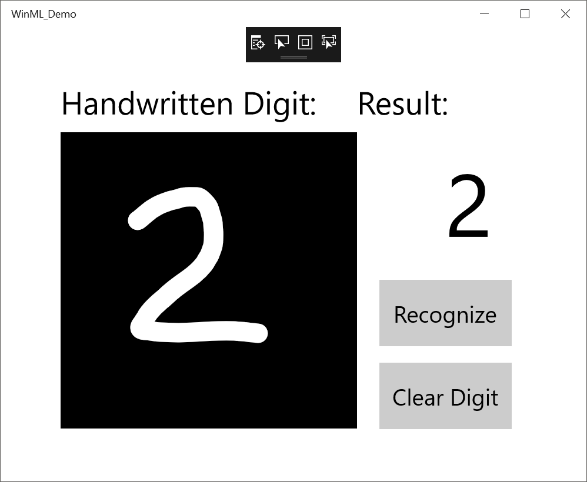

> [!VIDEO https://www.microsoft.com/en-us/videoplayer/embed/RE2Mn0x]

The pattern we want to follow when adding ONNX models to our UWP app is: Load > Bind > Evaluate:

- Load the machine learning model.
- Bind inputs and outputs to the model.
- Evaluate the model and view results.

1. Open the `MainPage.xaml.cs` file so that we can instantiate the model, inputs, and outputs that Visual Studio auto-generated for us when the model was added.

2. Inside the **MNIST_Demo** namespace and `MainPage` class, just above the `Helper` class, add the following: 

```csharp
namespace MNIST_Demo
{
	public sealed partial class MainPage : Page
	{
	    private mnistModel modelGen;
	    private mnistInput mnistInput = new mnistInput();
	    private mnistOutput mnistOutput;

        private Helper helper = new Helper();
	    ...
	}
}
```

## Load the model asynchronously

We created a method named “LoadModelAsync”, including “Async” in the name following C# naming conventions since it will be used asynchronously, with await. By loading the model asynchronously, the evaluation process won’t interfere with our User Interface fluidity. 

We want to ensure this “LoadModelAsync” method is called before we use any of the other methods (for example, before the page's loaded event, `OnNavigatedTo` override, or anywhere before `recognizeButton_Click` is called). 

3. We need to set up a `StorageFile`, just like we would to access any other resource from our UWP app. We will use it with our model to make method calls from the classes generated when we added our ONNX model to the project. We will want to point the `StorageFile` to our model in the **Assets** folder: "ms-appx:///Assets/mnist.onnx". Add the following code inside our `LoadModelAsync` task. 

```csharp
private async Task LoadModelAsync()
{
    //Load a machine learning model
    StorageFile modelFile = await StorageFile.GetFileFromApplicationUriAsync(new Uri("ms-appx:///Assets/mnist.onnx"));
    modelGen = await mnistModel.CreateFromStreamAsync(modelFile as IRandomAccessStreamReference);
}
```

The `mnistModel` class represents the "MNIST" machine learning ONNX model and creates the session on the system default device. To load the model, we call the `CreateFromStreamAsync` method (auto-generated within the `mnistModel` class when we added the ONNX model to Visual Studio), passing in the ONNX file as the parameter.

This functioning is all asynchronous, so we can add an `await` and the Windows ML process is not going to get in the way of anything. While our model is performing an evaluation, our UI is still going to be fluid. 

## Bind inputs to the model

Now that we’ve loaded the model file, the next step is to provide the model with the type of input it is expecting. 

4. Add the following code inside the `recognizeButton_Click` event.

```csharp
private async void recognizeButton_Click(object sender, RoutedEventArgs e)
{
    //Bind model input with contents from InkCanvas
    VideoFrame vf = await helper.GetHandWrittenImage(inkGrid);
    mnistInput.Input3 = ImageFeatureValue.CreateFromVideoFrame(vf);
}
```

One of the classes that we instantiated is called `mnistInput`, based on the input class generated from within the ONNX model when we added it to Visual Studio. Looking in the `mnistInput` class, we can see the `Input3` property and that it expects an `ImageFeatureValue`. 

There can often be a lot work with image files to massage the file format into the input type that the model is expecting. Windows ML abstracts that away by using `VideoFrame` as the currency of data exchange between the UI layer and what the model is expecting. Using this Windows ML standard `ImageFeatureValue` class, we can call `CreateFromVideoFrame` and, with the `helper.cs` function we instantiated earlier, grab the contents that we draw into the **InkCanvas**, convert it to a `VideoFrame`, and bind it to our model inside the `recognizeButton_Click` event. 

Now we’ve hooked up the InkCanvas so that it creates a `videoFrame` provind the type of input that our ONNX model expects. The next thing is to try to evaluate the model and get an output.

## Bind outputs to the model

Looking in our VS-generated `modelGen` class, we can see that an `EvaluateAsync` method has been provided. Using the `mnistOutput` class instantiated earlier, we can pass our `mnistInput` into this `EvaluateAsync` method to perform the evaluation on our InkCanvas drawing.

5. Add the following code inside the `recognizeButton_Click` event, below the code to bind the model input.

```csharp
//Evaluate the model
    mnistOutput = await modelGen.EvaluateAsync(modelInput);
```

Now, when we select the **Recognize** button, the model converts our InkCanvas content to a `videoFrame`, feeds it to our ML model `Input3` property as the `ImageFeatureValue` data type, the model then evaluates that input data with the `EvaluateAsync` method and passes the results back to the `mnistOutput`. 

At this point, we’ve written all the code you need to load a model, to bind inputs and outputs to that model, and to call an evaluation. We now need to handle the evaluation results from that model output. 

## Display evaluation results

Since the model returns a `TensorFloat` as the output, `Plus214_Output_0` as found in the generated `mnistOutput` class, we first need to convert it to a friendly data type with the `GetAsVectorView` method so that we can work with the array in C#. For this particular ML model, the output is a prediction of the digit that we just drew on the screen based on a list of 10 numbers (0-9). 

6. Add the following code inside the `recognizeButton_Click` event, below the code to evaluate the model.

```csharp
    //Convert output to datatype
    IReadOnlyList<float> vectorImage = mnistOutput.Plus214_Output_0.GetAsVectorView();
    IList<float> imageList = vectorImage.ToList();
```

Once the array is converted to a vector list, we can parse the returned list to determine which digit had the highest probability and display that one. 

7. Add the following code inside the `recognizeButton_Click` event, below where we converted the output datatype.

```csharp
    //Query to check for highest probability digit
    var maxIndex = imageList.IndexOf(imageList.Max());
 ```
 
We can now display that digit result as text in our `numberLabel` display field.

8. Add the following to display the number with the highest probability of being accurate to what the drawing intended.

```csharp
    //Display the results
    numberLabel.Text = maxIndex.ToString();
```

## Clear the Ink Canvas

Finally, we'll want to include code in our **Clear Digit** button to clear out the **InkCanvas** to allow users to draw and evaluate another number.

9. Add `numberLabel.Text="";` inside the `clearButton_Click` event, like shown below.

```csharp
private void clearButton_Click(object sender, RoutedEventArgs e)
{
    inkCanvas.InkPresenter.StrokeContainer.Clear();
    numberLabel.Text = "";
}
```

## Launch the application

To build and launch the application, select the **▶ Local Machine** button on your Visual Studio top menu bar. Once the application opens, we'll be able to draw a number on the **InkCanvas** using the mouse (or touchscreen or pen) and select the **Recognize** button to ask our MNIST machine learning model to evaluate and identify the number drawn based on our 0-9 scale of digits. 



### Completed code file

The completed code for our MainPage.xaml.cs file should read as follows.

```csharp
using System;
using System.Collections.Generic;
using System.Linq;
using Windows.Foundation;
using Windows.UI.Xaml;
using Windows.UI.Xaml.Controls;
using Windows.Storage;
using Windows.UI.Xaml.Media.Imaging;
using Windows.AI.MachineLearning;
using Windows.Media;
using Windows.Storage.Streams;
using System.Threading.Tasks;

namespace MNIST_Demo
{
    public sealed partial class MainPage : Page
    {
        private mnistModel modelGen;
        private mnistInput mnistInput = new mnistInput();
        private mnistOutput mnistOutput;
        
        private Helper helper = new Helper();
        RenderTargetBitmap renderBitmap = new RenderTargetBitmap();

        public MainPage()
        {
            this.InitializeComponent();

            // Set supported inking device types.
            inkCanvas.InkPresenter.InputDeviceTypes = Windows.UI.Core.CoreInputDeviceTypes.Mouse | Windows.UI.Core.CoreInputDeviceTypes.Pen | Windows.UI.Core.CoreInputDeviceTypes.Touch;
            inkCanvas.InkPresenter.UpdateDefaultDrawingAttributes(
                new Windows.UI.Input.Inking.InkDrawingAttributes()
                {
                    Color = Windows.UI.Colors.White,
                    Size = new Size(22, 22),
                    IgnorePressure = true,
                    IgnoreTilt = true,
                }
            );
            Task.Run(async () => await LoadModelAsync());
        }

        private async Task LoadModelAsync()
        {
            //Load a machine learning model
            StorageFile modelFile = await StorageFile.GetFileFromApplicationUriAsync(new Uri("ms-appx:///Assets/mnist.onnx"));
            modelGen = await mnistModel.CreateFromStreamAsync(modelFile as IRandomAccessStreamReference);
        }

        private async void recognizeButton_Click(object sender, RoutedEventArgs e)
        {
            //Bind model input with contents from InkCanvas
            VideoFrame vf = await helper.GetHandWrittenImage(inkGrid);
            mnistInput.Input3 = ImageFeatureValue.CreateFromVideoFrame(vf);
            
            //Evaluate the model
            mnistOutput = await modelGen.EvaluateAsync(mnistInput);

            //Convert output to datatype
            IReadOnlyList<float> vectorImage = mnistOutput.Plus214_Output_0.GetAsVectorView();
            IList<float> imageList = vectorImage.ToList();

            //LINQ query to check for highest probability digit
            var maxIndex = imageList.IndexOf(imageList.Max());

            //Display the results
            numberLabel.Text = maxIndex.ToString();
        }

        private void clearButton_Click(object sender, RoutedEventArgs e)
        {
            inkCanvas.InkPresenter.StrokeContainer.Clear();
            numberLabel.Text = "";
        }
    }
}
```
