In this unit, we will build a substantial sample in one or more of the three Windows UI technologies: Windows Forms, Windows Presentation Foundation (WPF), and Universal Windows Platform (UWP). The idea is to write an app that downloads and displays NASA's wonderful Astronomy Picture of the Day (APOD for short), given any date since the launch of this project in 1995. The app will also preserve some user settings from one session to the next. This is important as there are limits to the number of downloads that can be done in any one day (currently 50), and we want to make our app cognizant of this limit and not simply suddenly fail on our users. The process of restricting a user's access when they exceed a limit like this is known as *throttling*. So, let's build an inspiring app that helps us avoid being throttled!

In this unit, we will:

- Use Visual Studio 2017 to create up to three projects (Windows Forms, WPF, and UWP) with the aim of displaying the APOD for any date since the launch of this NASA program.
- Learn how to use the NuGet Package Manager to install a useful third-party API.
- Learn how to use a UI calendar to select a date, and an image element to display a picture.
- Make an HTTP call to retrieve an image.
- Check for supported image formats, and robustly handle errors.
- Save and restore UI settings to show how to make an app more user-friendly.
- Work at building a larger app in testable stages, verifying one stage works before moving to the next.
- Optionally, progress from the venerable Windows Forms, through WPF, and finally to UWP, showing how the newer technologies offers some great programming features.


Inspiring as this app is, it does not do everything an industrial strength app might do. In this unit, we will not:
- Cleverly handle the case where a video was offered as the picture of the day. We will just offer up an error message.
- Neither will we display something for the user to look at if the network connection is taking too long.

### The APOD tutorial

::: zone pivot="windowsforms"


Windows Forms may be dated, but the tools it provides do make a very neat version of this programming project.

#### 1. Create the project

1. With Visual Studio 17 open, create a Windows Forms C# project. Give the project a meaningful name. If you are going to do the UWP or WPF versions of this tutorial too, perhaps add the technology to the name, something like **APOD_WindowsForms**.

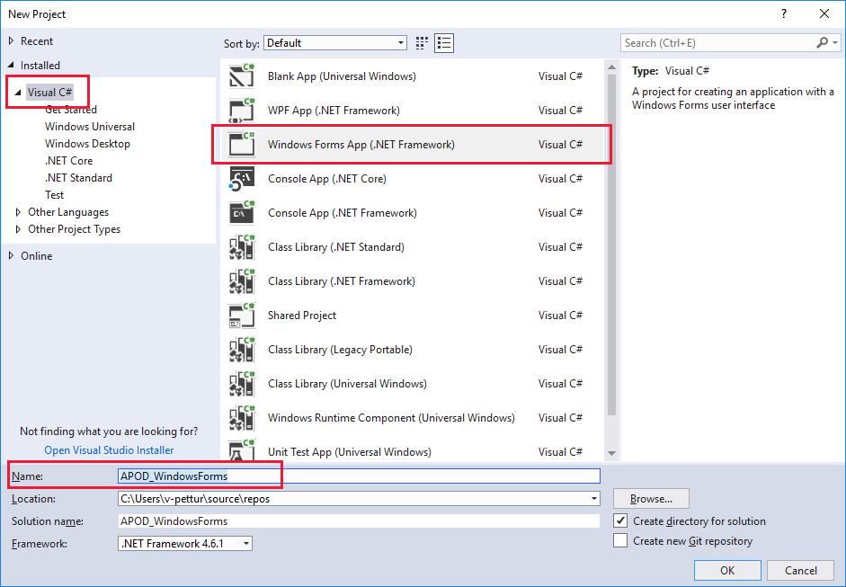

#### 2. Install the required packages

1. Re-inventing the wheel (in our case, writing code that has been written many times before) is not smart, so let's download an add-on package for Visual Studio that will help us parse the response when we make HTTP calls. A popular add-on for this is from Newtonsoft, so open up **Tools > NuGet Package Manager > Manage NuGet Packages for Solution**. This will show the list of _installed_ packages.

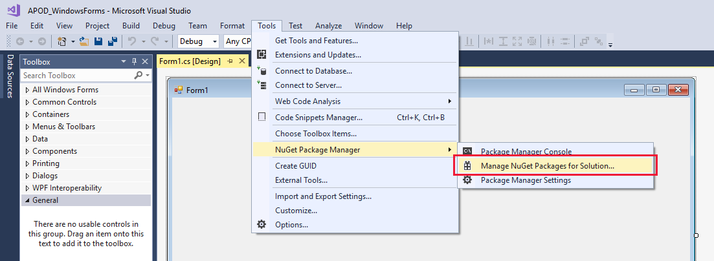

2. Select **Browse** to bring up the list of available packages. Select **Newtonsoft.Json** so it is highlighted, select the check box for your project in the right hand pane, and then select **Install**.

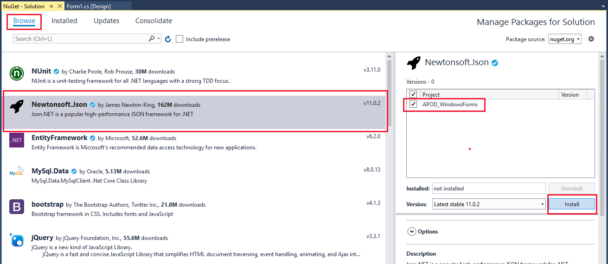

> [!NOTE]
> If you are going to be doing more HTTP programming, consider familiarizing yourself with the **Microsoft.AspNet.WebApi 5.2.6** package. This includes Newtonsoft.Json with a number of Microsoft ASP.Net web packages, and is a great set of web resources to have at your command!

#### 3. Build the UI

The goal of this section is to layout the UI components, and give them a quick test. 

1. Start by expanding the empty form until it is about 980 pixels wide and 680 pixels in height. The name of the form can be left as **Form1**, but change the **Text** property to something more friendly: something like **Astronomy Picture of the Day**.

2. Now add the UI elements to build the UI shown in the following image. Start in the top left-hand corner with the **MonthCalendar**. First make sure the **Toolbox** is open with **All Windows Forms** listed. We are going to use a few elements not available in the **Common Controls**.

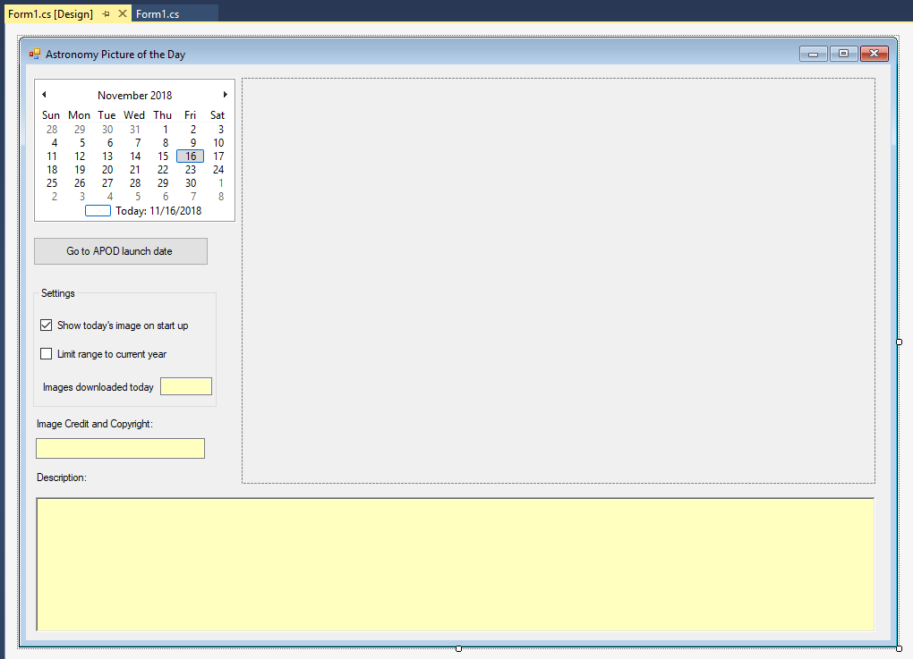

3. Name the calendar element **MonthCalendar**. We are not going to set any other properties of the calendar from the **Properties** pane. We will be setting properties from within the code itself.

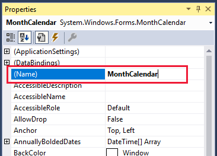

4. Below the calendar add a **Button**. Stretch it out so that it can take **Go to APOD launch date** as its **Text** property. Go ahead and add this text, and change the **Name** of the button to **LaunchButton**. When this button is pressed, the plan is that the calendar will jump to the day NASA started the APOD program. We won't add that code just yet, but continue laying out the UI.

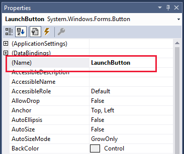
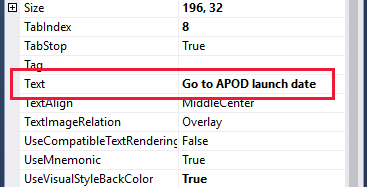

5. Below the button add a **GroupBox**, and give it a descriptive name like **Settings**. Expand the group box so that it can take three UI elements. First drag a **CheckBox** into the group box. Change the name of the check box to **ShowTodaysImageCheckBox**, and change the **Text** of this check box to **Show today's image on start up**.

> [!NOTE]
> The purpose of this check box is to give the option of _not_ loading an image when the app is started up. This is because there is a limit to the number of downloads of the astronomy images of 50 per day. A user might want to run the app several times in a day, and might not want to eat into their 50 image limit each time the app is started up (which would happen if todays image was retrieved and rendered each time). This is an example of a setting that is ideally stored in an initialization file of some sort.

6. Similar to the previous check box, add a second check box, name it **LimitRangeCheckBox** and change it's **Text** property to read **Limit range to current year**. This is perhaps a bit of an arbitrary setting, the idea is that we limit the range of options available to the **MonthCalendar** to just the current year, and also store this as an initialization setting.

7. The third entry into the group box should be a combination of a **Label** with the text **Images downloaded today:**, and a small **TextBox** entry that will display the number of images already downloaded today. Give the text box the name **ImagesTodayTextBox**, and set a couple of other properties on it. This text box is obviously read-only, so let's both set the **ReadOnly** property to true, and set a color background that hints that this text box is read only. Set the **BackColor** entry to **255,255,192** (an easy edit as the default RGB value is 255), so just change the last of these to **192**. This gives a nice light yellow color that works as a background for black text.

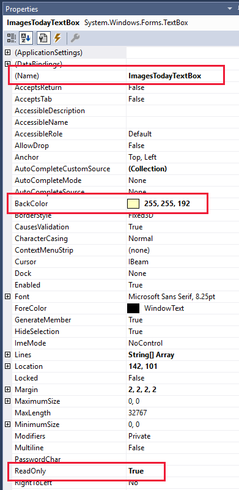

8. That completes the group box encapsulating any setting we might need to preserve. Add another **Label** and **TextBox** combination beneath the group box, with the text for the label being **Image Credit and Copyright:** and the text box itself having the name **ImageCopyrightTextBox**. Similar to the **ImagesTodayTextBox** this text is also read-only, so again set the **ReadOnly** property to true, and the background color to **255,255,192**. Expand the text box so it is about the same width as the calendar. It is important that we acknowledge the copyright of the wonderful images we want to download and display!

9. Another label and read-only text box combination is needed. Add a label with the text **Description:** and a nice big text box to take a good paragraph; perhaps 940 pixels wide and 150 pixels in height, or thereabouts. Text boxes are scrollable as long as the **Multiline** property is set to **True**, which it should be by default.

10. Finally add a sizeable **PictureBox** element to fill most of the real estate of your form. On or around 700 pixels wide and 450 pixels high will work. Change its name to **ImagePictureBox**, and change its border to **FixedSingle**. Also, change its **SizeMode** setting to **Zoom**, which will ensure the image is scaled to fit your picture box.

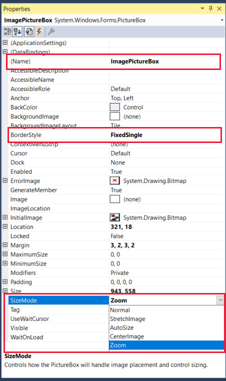

11. On the **Debug** menu, select **Start without debugging**. Nothing will work as we have only laid out the UI elements, but it does give us a chance to clean up the appearance before moving on. If anything in the UI looks skewed, go back to the designer and clean it up. 

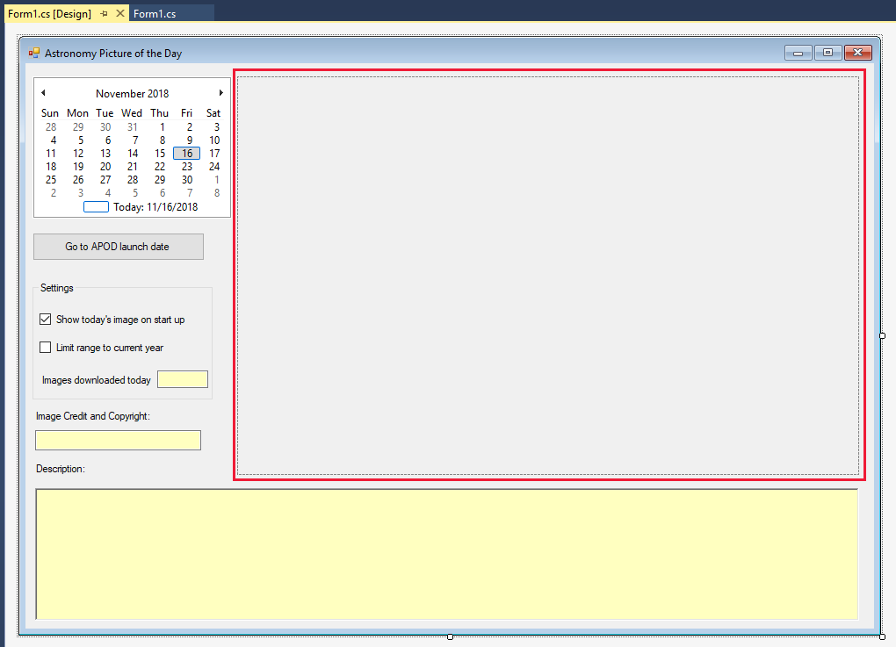

#### 4. Add code to handle the UI elements

Only a few of our UI elements need to have events associated with them. Let's work through them one by one.

1. Before we enter any events, lets add a few global values that are going to be useful. Add the endpoint needed to call the NASA service, the launch date of the program, and lets set a couple of defaults on the range of dates available to the calendar. The first section of your **Form1** class should read as follows.

```cs
        // The objective of the NASA API portal is to make NASA data, including imagery, eminently accessible to application developers. 
        const string EndpointURL = "https://api.nasa.gov/planetary/apod";

        // June 16, 1995  : the APOD launch date.
        DateTime launchDate = new DateTime(1995, 6, 16);

        public Form1()
        {
            InitializeComponent();

            // Set the maximum date to today, and the minimum date to the date APOD was launched.
            MonthCalendar.MaxDate = DateTime.Today;            
            MonthCalendar.MinDate = launchDate;
        }

```

2. In the design view, select the button we named **LaunchButton**, or, in the events for this button, select the **Click** event. Either way, the **LaunchButton_Click** method will be created, and the Form1.cs code file opened up to show it.

3. Insert the body of the **LaunchButton_Click** method. It sets the selected date of the calendar to the launch date of the APOD program, but first sets the **LimitRangeCheckBox** to false, which it may be already, just to ensure the full range of dates is available in the calendar. Setting this check box to false just keeps things consistent. The launch date of the program should only be available if the date range available is not restricted to the current year.

```cs
        private void LaunchButton_Click(object sender, EventArgs e)
        {
            // Make sure the full range of dates is available.
            // This might invoke a call to LimitRangeCheckBox_CheckedChanged.
            LimitRangeCheckBox.Checked = false;

            // This will not load up the first APOD image, just sets the calendar to the APOD launch date.
            MonthCalendar.SelectionEnd = launchDate;
        }
```

3. Now enter the code for the **LimitRangeCheckBox**. This code should change the range of dates available in the calendar from the full history of the program to just the current year. Select the check box in the designer (or on the **CheckedChanged** event in the list of events for the check box) to add an empty method for this event. Then add the following code.

```cs
        private void LimitRangeCheckBox_CheckedChanged(object sender, EventArgs e)
        {
            if (LimitRangeCheckBox.Checked)
            {
                var thisYear = new DateTime(DateTime.Today.Year, 1, 1);
                MonthCalendar.MinDate = thisYear;              
            }
            else
            {
                MonthCalendar.MinDate = launchDate;
            }
        }
```

4. The last event we need is to react to a date being selected in the **MonthCalendar**. Open up the events for this and select **DateSelected**. This will create the following method.

```cs
        private void MonthCalendar_DateSelected(object sender, DateRangeEventArgs e)
        {

        }

```

5. Before going any further, let's test what we have done. 

#### 5. Test that the UI elements work

We are going to test what we can so far. First, we are going to test that selecting the **LimitRangeCheckBox** does limit the range of dates available in the calendar correctly, and then we are going to test that selecting a date in the calendar calls the right event. We can also check that selecting any other UI element does _not_ fire any events!

1. In the **Debug** menu, select **Start Debugging**. When the app runs, go to the calendar and get savvy with all the options available to you. You can select a date. You can also change months and years by clicking on the top line of the calendar. Try changing to years and going back as far as you can. It should stop at 1995.

2. The calendar is quite an impressive UI element. It has lots of features all working and no extra code that you need to add. Note you can select date ranges with this element too, though only selecting an individual date makes any sense for this app.

3. Now check the **Limit range to current year** check box. Go back and play with the calendar. You should notice that you now cannot go back beyond the first of the year. Now uncheck that check box and ensure you can now go back to 1995.

4. In the **MonthCalendar_DateSelected** event, now set a break point on the first "{". Do this by right-clicking on that line of code, and selecting **Breakpoint > Insert Breakpoint** from the menu. If you have got it right, a red circle will appear to the left of the line number.

5. Now select any selected date in the calendar. This should stop the program at the breakpoint. Select **Continue** from the **Debug** menu when you have verified the program has correctly halted on the event. Try this with a couple of dates, then we are done. Select **Stop Debugging** from the **Debug** menu. The UI test is now over. Now we want something way more exciting than this to happen when we select a date.

#### 6. Add code to download an image

1. Now we need to be sure we have all the resources available to us. Remember we installed the Newtonsoft package, and we are going to need to call some HTTP functions too. Make sure your list of **using** statements at the top of the Form1.cs file includes all of the following.

```cs
using System;
using System.Net.Http;
using System.Net.Http.Headers;
using System.Threading.Tasks;
using System.Windows.Forms;
using System.IO;
using Newtonsoft.Json.Linq;

```

2. Next we need to do a little bit of research. We know that the APOD is an image, but it can also be video (a scenario we are not going to support). However, there are quite a few image formats out there. By researching those available in Windows Forms, we can add a test to ensure a downloaded image is in a supported format. Add the following method to your class. All it does is extract the extension from a URL, and return true if that extension is supported.

```cs
        private bool IsSupportedFormat(string photoURL)
        {
            // Extract the extension and force to lower case for comparison purposes.
            string ext = Path.GetExtension(photoURL).ToLower();

            // Check the extension against supported Windows Forms formats.
            return (ext == ".jpg" || ext == ".jpeg" || ext == ".png" || ext == ".gif" || ext == ".bmp" || 
                    ext == ".tif");

        }
```

3. Now we add the real meat of the program: the method to retrieve an image. This is a somewhat involved method. First note that it is coded as an asynchronous **Task**. Read through the comments in the code to understand the flow, or at least, begin to understand it!

```cs
        private async Task RetrievePhoto()
        {
            var client = new HttpClient();           
            JObject jResult = null;
            string responseContent = null;
            string description = null;
            string photoUrl = null;
            string copyright = null;

            // Set the UI elements to defaults.
            ImageCopyrightTextBox.Text = "NASA";
            DescriptionTextBox.Text = "";

            // Build the date parameter string for the date selected, or the last date if a range is specified.
            DateTime dt = MonthCalendar.SelectionEnd;
            string dateSelected =  $"{dt.Year.ToString()}-{dt.Month.ToString("00")}-{dt.Day.ToString("00")}";            
            string URLParams = $"?date={dateSelected}&api_key=DEMO_KEY";

            // Populate the Http client appropriately
            client.BaseAddress = new Uri(EndpointURL);
            client.DefaultRequestHeaders.Accept.Add(new MediaTypeWithQualityHeaderValue("application/json"));

            // The critical call: sends a GET request with the appropriate parameters.
            HttpResponseMessage response = client.GetAsync(URLParams).Result;

            if (response.IsSuccessStatusCode)
            {
                // Be ready to catch any data/server errors.
                try
                {
                    // Parse response using the Newtonsoft APIs.
                    responseContent = await response.Content.ReadAsStringAsync();

                    // Parse the response string for the details we need.
                    jResult = JObject.Parse(responseContent);

                    // Now get the image.
                    photoUrl = (string)jResult["url"];
                    ImagePictureBox.ImageLocation = photoUrl;

                    if (IsSupportedFormat(photoUrl))
                    {
                        // Get the copyright message, but fill with "NASA" if no name is provided.
                        copyright = (string)jResult["copyright"];
                        if (copyright != null && copyright.Length > 0)
                        {
                            ImageCopyrightTextBox.Text = copyright;
                        }

                        // Populate the description text box.
                        description = (string)jResult["explanation"];
                        DescriptionTextBox.Text = description;
                    }
                    else
                    {
                        DescriptionTextBox.Text = $"Image type is not supported. URL is {photoUrl}";
                    }
                }
                catch (Exception ex)
                {
                    DescriptionTextBox.Text = $"Image data is not supported. {ex.Message}";
                }

                // Keep track of our downloads, in case we reach the limit.
                ++imageCountToday;
                ImagesTodayTextBox.Text = imageCountToday.ToString();
            }
            else
            {
                DescriptionTextBox.Text = "We were unable to retrieve the NASA picture for that day: " +
                    $"{response.StatusCode.ToString()} {response.ReasonPhrase}";
            }
        }
```

4. There is one more thing we need to do before testing our app so far, and that is to complete the **DateSelected** method. Note that we must add the **async** keyword to the method definition, and the use of **await** when making the call. In other words, even though the call is asynchronous, we are going to wait for the result before proceeding.

```cs
        private async void MonthCalendar_DateSelected(object sender, DateRangeEventArgs e)
        {
            await RetrievePhoto();
        }
```

#### 7. Test that the program downloads and displays an image

This is the test we have all been waiting for. Will the app download and render an image!

1. Nothing for it but to try. Run the app (from the **Debug** menu, or simply select F5). 

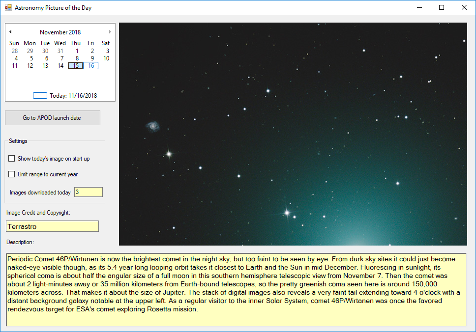

2. Does it work? Can you select dates from the calendar and render some fantastic images of space? If so great, if not, carefully check your code against that listed above.

#### 8. Add code to save/restore settings

The next step is a bit more mundane. What we want to do is preserve the user's selections from one running of the app to the next. In this tutorial, we are going to do this by creating an init file. This file is read when the app is opened, and the UI elements are set based on the contents of this file before the user does anything. When the user exits the app, the current settings are saved off, awaiting the next running of the app.

Apps that do not preserve user preferences can get tedious to use after a while. It is good practice to make your apps user-friendly in this way.

1. The logic for our settings is as follows. We want to give the user the option of _not_ displaying today's astronomy picture on start up, in case they have already seen it and do not want to use up one of their 50 downloads per day. This means we have to save off today's date, the startup setting, and the count of images downloaded today already. We have also added in the setting to limit the range of dates (more as an example of how to save and restore settings than anything else). The first step is to provide name strings for these four settings, so add the following code as globals for your Form1 class.

```cs
        // Init file name strings, used to preserve UI values between sessions.
        const string SettingDateToday = "date today";
        const string SettingShowOnStartup = "show on startup";
        const string SettingImageCountToday = "image count today";
        const string SettingLimitRange = "limit range";
```

2. We also need a string to hold the path to the init file. We need a count of the images downloaded, and a string to use to separate the settings into name/value pairs. So add these globals too.

```cs
        // The full path to the init file.
        string initFilePath;

        // A count of images downloaded today.
        int imageCountToday;                 
        
        // A char used to divide the name from the value in the init file.
        const char SettingDivider = ':';               
```

3. Let's store the init file in the same folder as the app itself. Add the following line to the **Form1()** constructor method.

```cs
            // The init file is stored in the same folder as the application.
            initFilePath = Path.Combine(Application.StartupPath, "init_apod.txt");
```

4. Let's now think about how these settings are written out. We need to add an event when the app is closed. Do this by selecting the form in the design view (just click anywhere on the form that is not a UI element) to bring up the form properties, select the event icon, then select the **FormClosed** event. This will add skeletal code for an event called **Form1_FormClosed**. The only code that's needed in this event is to call a method to write out the init file.

```cs
        private void Form1_FormClosed(object sender, FormClosedEventArgs e)
        {
            WriteInitFile();
        }
```

5. Now write that method. Using the **StreamWriter** object is very helpful in this situation, and six lines is all that is needed for the body of the method. Note the use of the divider string to separate the name of a setting from its value.

```cs
        private void WriteInitFile()
        {
            using (var sw = new StreamWriter(initFilePath))
            {
                // Write out todays date, to keep track of the downloads per day.
                sw.WriteLine($"{SettingDateToday}{SettingDivider}{DateTime.Today.ToShortDateString()}");

                // Write out the number of images we have downloaded today.
                sw.WriteLine($"{SettingImageCountToday}{SettingDivider}{imageCountToday.ToString()}");

                // Write out the UI settings we want to preserve for the next time.
                sw.WriteLine($"{SettingShowOnStartup}{SettingDivider}{ShowTodaysImageCheckBox.Checked.ToString()}");
                sw.WriteLine($"{SettingLimitRange}{SettingDivider}{LimitRangeCheckBox.Checked.ToString()}");
            }
        }
```
> [!NOTE]
> By declaring the settings strings, and divider string, as globals for use in both reading and writing the settings, we avoid errors induced by spelling mistakes, punctuation, spacing, and other tedious mistakes that so often lead to an app not working.


5. Test the code so far. Open up the app and simply close it again immediately. Navigate to the folder containing the app (hint: use the **Save File As** menu option to find the folder where your project is located). Open up the file called init_apod.txt. Open in Notepad, it should look something like this.

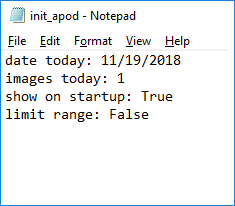

> [!NOTE]
> By naming our settings to be human readable, we are able to validate that the app is working correctly, even though the ultimate use of the init file does not require that it is ever read by a human.

6. The more complex of the operations is to read the init file in. Reading the init file is called from the Form1 constructor, so add this line at the end of the method.

```cs           
        public Form1()
        {
            InitializeComponent();

            // Set the maximum date to today, and the minimum date to the date APOD was launched.
            MonthCalendar.MaxDate = DateTime.Today;            
            MonthCalendar.MinDate = launchDate;

            // The init file is stored in the same folder as the application.
            initFilePath = Path.Combine(Application.StartupPath, "init_apod.txt");

            // Read the init file and set UI fields.
            ReadInitFile();
        }
```

7. Reading the init file takes a bit of work. Copy and paste in the following method, and read through the comments. Note how each setting string is parsed, and the appropriate UI elements updated. Of course, when the app is first run there is no init file, so we must handle the setting of initial defaults. Finally we display the number of images downloaded today in the UI text box, and trigger a date-selected event if we need to render today's image.

```cs
        private void ReadInitFile()
        {
            // Check that we have an init file.
            if (File.Exists(initFilePath))
            {
                String line = null;
                String[] part;
                bool isToday = false;

                using (var sr = new StreamReader(initFilePath))
                {
                    while ((line = sr.ReadLine()) != null)
                    {
                        // Split the line into the part before the divider (the name), and the part after (the value).
                        part = line.Split(SettingDivider);

                        // Switch on the "name" part, and then process the "value" part.
                        switch (part[0])
                        {
                            // Read the date, and if it is today's date, read the number of images we have already downloaded today.
                            // If it is not today's date, set the number of downloads back to zero.
                            case SettingDateToday:
                                var dt = DateTime.Parse(part[1]);
                                if (dt.Equals(DateTime.Today))
                                {
                                    isToday = true;
                                }
                                break;

                            case SettingImageCountToday:

                                // If the last time the app was used was earlier today, then the 
                                // image count stored is valid against the 50 per day maximum.
                                if (isToday)
                                {
                                    imageCountToday = int.Parse(part[1]);
                                }
                                else
                                {
                                    imageCountToday = 0;
                                }
                                break;

                            case SettingShowOnStartup:
                                ShowTodaysImageCheckBox.Checked = bool.Parse(part[1]);
                                break;

                            case SettingLimitRange:

                                // This might invoke a call to LimitRangeCheckBox_CheckedChanged.
                                LimitRangeCheckBox.Checked = bool.Parse(part[1]);
                                break;

                                // This line is for debugging purposes.
                            default:
                                throw new Exception($"Unknown init file entry: {line}");
                        }
                    }
                }
            }
            else
            {
                // No init file exists yet - so set defaults.
                imageCountToday = 0;
                ShowTodaysImageCheckBox.Checked = true;
                LimitRangeCheckBox.Checked = false;
            }

            ImagesTodayTextBox.Text = imageCountToday.ToString();

            // Invoke a call to retrieve a picture on start up, if required by the setting.
            if (ShowTodaysImageCheckBox.Checked)
            {
                MonthCalendar_DateSelected(null, null);
            }
        }
```

8. Now back to the fun side of programming!

#### 9. Test the completed Windows Forms program

1. Build and run the completed app. 

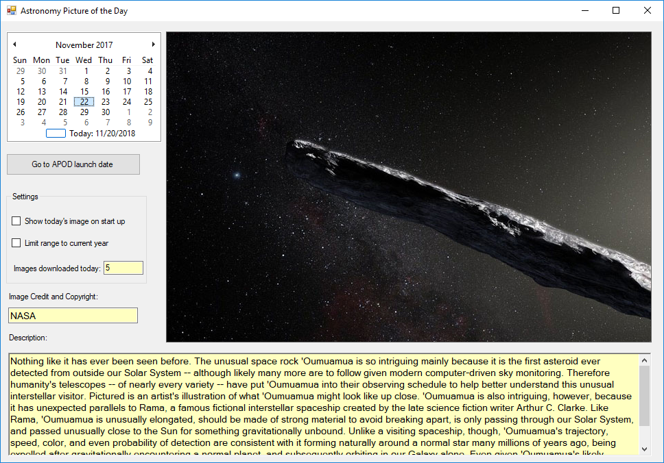

2. Change some of the settings, close the app, and run it again. Are the settings preserved correctly? Is the count of images downloaded correct?

3. Check out some of the amazing astronomy photography by selecting dates at random or perhaps dates of special meaning to you. Wonderful stuff! 

And great job completing the tutorial.

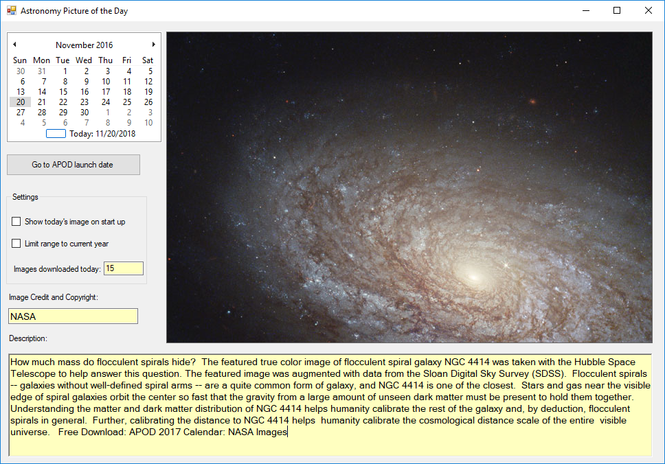

::: zone-end


::: zone pivot="wpf"

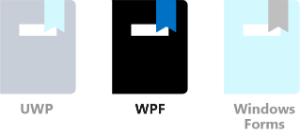

#### 1. Create the Project

With Visual Studio 17 opened, create a WPF C# project. Give the project a meaningful name, something like **APOD_WPF**.

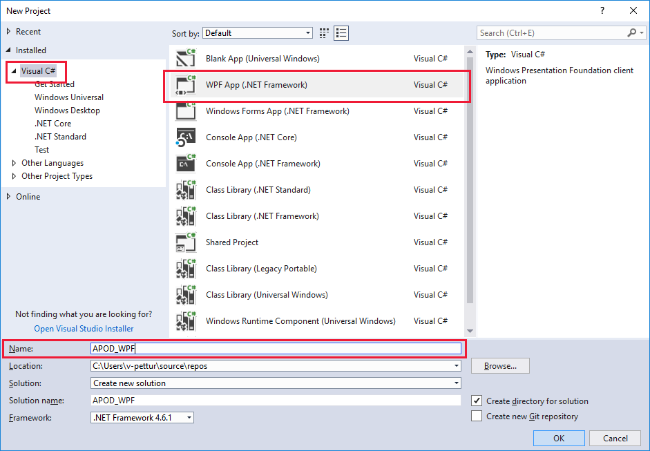

#### 2. Install the required packages

1. Re-inventing the wheel (in our case, writing code that has been written many times before) is not smart, so let's download an add-on package for Visual Studio that will help us parse the response when we make HTTP calls. A popular add-on for this is from Newtonsoft, so open up **Tools > NuGet Package Manager > Manage NuGet Packages for Solution**. This will show the list of _installed_ packages.


2. Select **Browse** to bring up the list of available packages. Select **Newtonsoft.Json** so it is highlighted, select the check box for your project in the right hand pane, and then click **Install**.


#### 3. Build the UI

The goal of this section is to layout the UI components, and give them a quick test. We need to construct a UI similar to the following.

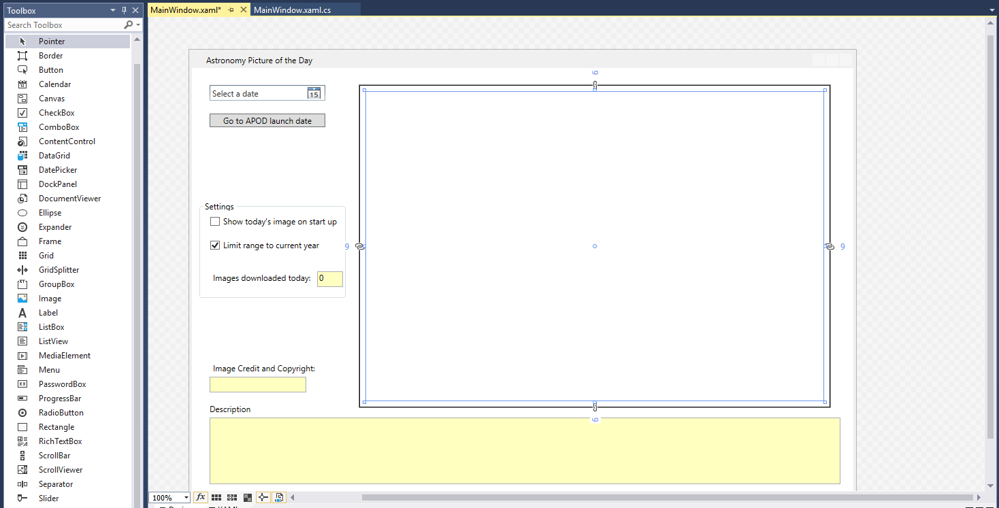

1. Start by opening up the **Toolbox** and expanding **All WPF Controls**. Locate the **DatePicker** element and drag it to the top left-hand location of the designer layout. In **Properties**, change its name to **MonthCalendar**.

2. Below the date picker, add a **Button**, change its name to **LaunchButton**, and change its **Content** property (in the **Common** category) to **Go to APOD launch date**. 

3. Now add, below the button, a **GroupBox**. No need to give it a name as we are not accessing it, but change its **Header** property (in the **Common** category) to **Settings**. This group box contains the settings that will be preserved from one run of the app to the next. Expand the group box so that it can take several lines of entries, but no need to be precise on this, you can align it precisely after adding the content.

4. Drag a **CheckBox** to the group box, change its name to **ShowTodaysImageCheckBox** and change its **Content** property (again in the **Common** category) to **Show today's image on start up**.

5. Drag a second **CheckBox** to the group box, change its name to **LimitRangeCheckBox** and its **Content** property to **Limit range to current year**.

6. Now add a **Label**, no need again for a name, but change the **Content** property to **Images downloaded today:**.

7. To the right of the label, add a small **TextBox**, name it **ImagesTodayTextBox**. This text is certainly read-only, so in the **Text** category of the properties, check the **IsReadOnly** check box. Now, open up the **Brush** category and select the **Background**, and change its blue color to **192**. This will give a good contrasting light yellow color as background for the black text, hinting that the text box is read-only. We will do the same for the other read-only text boxes that we need to add shortly.

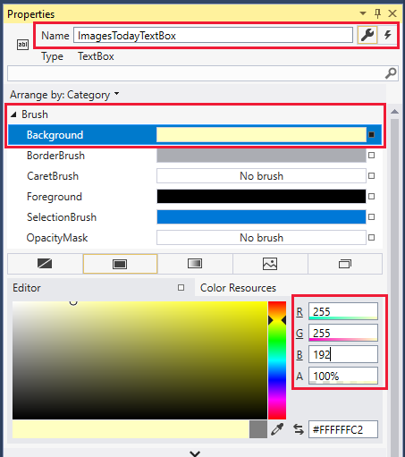

8. Adjust the alignment of the check boxes, label and text box, so that they all fit neatly inside the group box, similar to the layout shown at the start of this section.

9. It is important to credit the downloaded images with the correct name and copyright. So add another label/text box pair, underneath the group box. The label **Content** should be changed to **Image Credit and Copyright:**. The text box should be named **ImageCopyrightTextBox**. It should be expanded to a width that will allow most credits to show without scrolling, so perhaps expand it to the width of the group box. Finally, repeat the read-only procedure we did above: setting the **IsReadOnly** property, and the background color to light yellow.

10. Now add the third label/text box pair. The label should simply say **Description:**, but the text box should be expanded to nearly the full width of the layout, and be several lines in height. Name the text box **DescriptionTextBox**, and again set its read-only properties.

11. To make it easier to lay out all the elements neatly, drag a **Border** element to the layout and expand it to a good width and height. In the **Appearance** category, make sure all **BorderThickness** entries are set to **1**. In this case we will name the border, something like **PictureBorder**.

12. Now, with the border selected, drag an **Image** element from the toolbox into the border. This should match the image size with the border. Name the image **ImagePictureBox**. If you have difficulty selecting the image instead of the border, right click anywhere inside where the image should be, and select the **Set Current Selection** menu item. This is why we named the border, so both image and border show up clearly in this menu, and you can select the one you are working on.

13. On the **Debug** menu select **Start Without Debugging**. Nothing will work of course, but you will get the chance to view and tidy up the UI elements accordingly. Making the UI as neat as possible is good practice.

#### 4. Add code to handle the UI elements

Only a few of our UI elements need to have events associated with them. Let's work through them one by one.

1. Before we enter any events, lets add a few global values that are going to be useful. Add the endpoint needed to call the NASA service, the launch date of the APOD program, and a count of images downloaded today, and lets set a couple of defaults on the range of dates available to the calendar. We also need to add an odd flag **ignoreDoubleEvent** as WPF fires two events in some situations where the other technologies (Windows Forms, UWP) only fire one. If a double event is fired, we set a flag to ignore the first of these events. Your **MainWindow** class should read as follows.

```cs
    public partial class MainWindow : Window
    {
        // The objective of the NASA API portal is to make NASA data, including imagery, eminently accessible to application developers. 
        const string EndpointURL = "https://api.nasa.gov/planetary/apod";

        // June 16, 1995  : APOD launch date.
        DateTime launchDate = new DateTime(1995, 6, 16);

        // A count of images downloaded today.
        int imageCountToday;

        // Flag to ignore a strange double-event in WPF.
        bool ignoreDoubleEvent = false;

        public MainWindow()
        {
            InitializeComponent();

            // Set the maximum date to today, and the minimum date to the date APOD was launched.
            MonthCalendar.DisplayDateEnd = DateTime.Today;
            MonthCalendar.DisplayDateStart = launchDate;
        }
    }
```

2. In the design view select the button we named **LaunchButton**, and in the events for this button, select the  **Click** event. The **LaunchButton_Click** method will be created, and the MainWindow.xaml.cs code file opened up to show it.

3. Insert the body of the **LaunchButton_Click** method. It sets the selected date of the calendar to the launch date of the APOD program, but first sets the **LimitRangeCheckBox** to false, which it may be already, just to ensure the full range of dates is available in the calendar. Setting this check box to false just keeps things consistent. The launch date of the program should only be available if the date range available is not restricted to the current year.

```cs
        private void LaunchButton_Click(object sender, RoutedEventArgs e)
        {
            // Make sure the full range of dates is available.
            // This might invoke a call to LimitRangeCheckBox_CheckedChanged.
            LimitRangeCheckBox.IsChecked = false;

            // This will not load up the image, just sets the calendar to the APOD launch date.
            // This will fire a double event, the first of which needs to be ignored.
            ignoreDoubleEvent = true;
            MonthCalendar.SelectedDate = launchDate;
        }
```

4. Now enter the code for the **LimitRangeCheckBox**. This code should change the range of dates available in the calendar from the full history of the program to just the current year. Open up the events for this check box (by selecting the events icon in the **Properties** pane). Find the **Click** event, and select it. This will add the outline of the event method, so add the content shown below.

```cs
        private void LimitRangeCheckBox_Click(object sender, RoutedEventArgs e)
        {
            if (LimitRangeCheckBox.IsChecked == true)
            {
                // Set the minimum date of the calendar to the beginning of the year.
                var thisYear = new DateTime(DateTime.Today.Year, 1, 1);
                MonthCalendar.DisplayDateStart = thisYear;
            }
            else
            {
                // Set the minimum date of the calendar to the launch of the APOD program.
                MonthCalendar.DisplayDateStart = launchDate;
            }
        }
```

4. The last event we need is to react to is the important one: a date being selected in the **MonthCalendar**. Open up the events for this, scroll down through the alphabetic list, and select the **SelectedDateChanged** event.

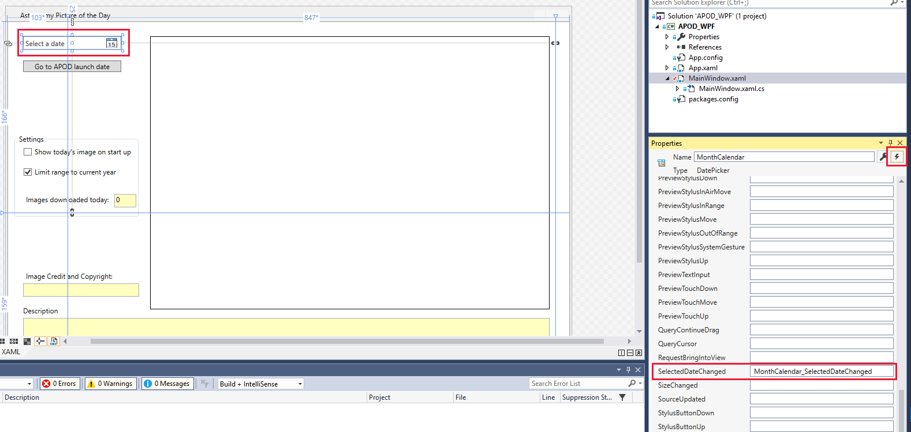

This will create the following method (leave it empty for now).

```cs
        private void MonthCalendar_SelectedDateChanged(object sender, SelectionChangedEventArgs e)
        {

        }

```

5. Before going any further, let's test what we have done. 

#### 5. Test that the UI elements work

We are going to test what we can so far. First, we are going to test that selecting the **LimitRangeCheckBox** does limit the range of dates available in the calendar correctly, and then we are going to test that selecting a date in the calendar calls the right event. We can also check that selecting any other UI element does _not_ fire any events!

1. In the **Debug** menu, select **Start Debugging**. When the app runs, go to the calendar and get savvy with all the options available to you. You can select a date. You can also change months and years by clicking on the top line of the calendar. Try changing to years and going back as far as you can. It should stop at 1995. The calendar is quite an impressive UI element. It has lots of features all working and no extra code that you need to add. 

2. Now check the **Limit range to current year** check box. Go back and play with the calendar. You should notice that you now cannot go back beyond the first of the year. Now uncheck that check box and ensure you can now go back to 1995.

3. In the **MonthCalendar_SelectedDateChanged** event, set a break point on the first "{". Do this by selecting that line of code, and selecting **Breakpoint > Insert Breakpoint** from the menu. If you have got it right, a red circle will appear to the left of the line number.

4. Now back in the app, select any selected date in the calendar. This should stop the program at the breakpoint. Select **Continue** from the **Debug** menu when you have verified the program has correctly halted on the event. Try this with a couple of dates, then we are done. Select **Stop Debugging** from the **Debug** menu. The UI test is now over. Now we want something way more exciting than this to happen when we select a date!


#### 6. Add code to download an image

1. Now we need to be sure we have all the resources available to us. Remember we installed the Newtonsoft package, and we are going to need to call some HTTP functions too. Make sure your list of **using** statements at the top of the MainWindow.xaml.cs file includes all of the following.

```cs
using System;
using System.Threading.Tasks;
using System.Windows;
using System.Windows.Controls;
using System.Windows.Media.Imaging;
using Newtonsoft.Json.Linq;
using System.Net.Http;
using System.Net.Http.Headers;
using System.IO;
```

2. Next we need to do a little bit of research. We know that the APOD is an image, but it can also be video (a scenario we are not going to support). However, there are quite a few image formats out there. By researching those available in WPF, we can add a test to ensure a downloaded image is in a supported format. Add the following method to your class. All it does is extract the extension from a URL, and return true if that extension is supported.

```cs
        private bool IsSupportedFormat(string photoURL)
        {
            // Extract the extension and force to lower case for comparison purposes.
            string ext = System.IO.Path.GetExtension(photoURL).ToLower();

            // Check the extension against supported WPF formats.
            return (ext == ".jpg" || ext == ".jpeg" || ext == ".png" || ext == ".gif" || ext == ".bmp" ||
                    ext == ".wmf" || ext == ".tif" || ext == ".ico");
        }
```

3. Now we add the real meat of the program: the method to retrieve an image. This is a somewhat involved method. First note that it is coded as an asynchronous **Task**. Read through the comments in the code to understand the flow, or at least, begin to understand it!

```cs
        private async Task RetrievePhoto()
        {
            var client = new HttpClient();
            JObject jResult = null;
            string responseContent = null;
            string description = null;
            string photoUrl = null;
            string copyright = null;

            // Set the UI elements to defaults.
            ImageCopyrightTextBox.Text = "NASA";
            DescriptionTextBox.Text = "";

            // Build the date parameter string for the date selected, or the last date if a range is specified.
            DateTime dt = (DateTime) MonthCalendar.SelectedDate;
            string dateSelected = $"{dt.Year.ToString()}-{dt.Month.ToString("00")}-{dt.Day.ToString("00")}";
            string URLParams = $"?date={dateSelected}&api_key=DEMO_KEY";

            // Populate the Http client appropriately.
            client.BaseAddress = new Uri(EndpointURL);
            client.DefaultRequestHeaders.Accept.Add(new MediaTypeWithQualityHeaderValue("application/json"));

            // The critical call: sends a GET request with the appropriate parameters.
            HttpResponseMessage response = client.GetAsync(URLParams).Result;

            if (response.IsSuccessStatusCode)
            {
                // Be ready to catch any data/server errors.
                try
                {
                    // Parse response using Newtonsoft APIs.
                    responseContent = await response.Content.ReadAsStringAsync();

                    // Parse the response string for the details we need.
                    jResult = JObject.Parse(responseContent);

                    // Now get the image.
                    photoUrl = (string)jResult["url"];
                    var photoURI = new Uri(photoUrl);
                    var bmi = new BitmapImage(photoURI);

                    ImagePictureBox.Source = bmi;

                    if (IsSupportedFormat(photoUrl))
                    {
                        // Get the copyright message, but fill with "NASA" if no name is provided.
                        copyright = (string)jResult["copyright"];
                        if (copyright != null && copyright.Length > 0)
                        {
                            ImageCopyrightTextBox.Text = copyright;
                        }

                        // Populate the description text box.
                        description = (string)jResult["explanation"];
                        DescriptionTextBox.Text = description;
                    }
                    else
                    {
                        DescriptionTextBox.Text = $"Image type is not supported. URL is {photoUrl}";
                    }
                }
                catch (Exception ex)
                {
                    DescriptionTextBox.Text = $"Image data is not supported. {ex.Message}";
                }

                // Keep track of our downloads, in case we reach the limit.
                ++imageCountToday;
                ImagesTodayTextBox.Text = imageCountToday.ToString();
            }
            else
            {
                DescriptionTextBox.Text = "We were unable to retrieve the NASA picture for that day: " +
                    $"{response.StatusCode.ToString()} {response.ReasonPhrase}";
            }
        }
```

4. There is one more thing we need to do before testing our app so far, and that is to complete the **MonthCalendar_SelectedDateChanged** method. Note that we must add the **async** keyword to the method definition, and the use of **await** when making the call. In other words, even though the call is asynchronous, we are going to wait for the result before proceeding. Note also we do not do call the method to retrieve a photo if the **ignoreDoubleEvent** flag is set, but we do clear that flag if this is the case.

```cs
        private async void MonthCalendar_SelectedDateChanged(object sender, SelectionChangedEventArgs e)
        {
            // Retrieve an image, unless a double event has been fired, in which case ignore the first event.
            if (!ignoreDoubleEvent)
            {
                await RetrievePhoto();
            }
            else
            {
                ignoreDoubleEvent = false;
            }
        }
```

That is all the coding we need to do before we test the app again.

#### 7. Test that the program downloads and displays an image

Now for the fun part of this tutorial.

1. In the **Debug** menu, select **Start Without Debugging** and select a date.

2. Did it work? Do you see some wonderful images when you select dates? If not, go back carefully over your code to locate what's gone amiss.

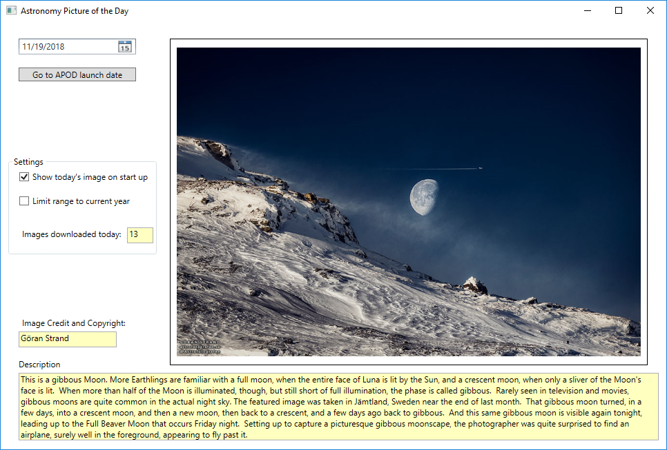


#### 8. Add code to save/restore settings

The next stage is a bit more mundane. What we want to do is preserve the user's selections from one run of the app to the next. In this tutorial, we are going to do this by creating an init file. This file is read when the app is opened, and the UI elements are set based on the contents of this file before the user does anything. When the user exits the app, the current settings are saved off, awaiting the next running of the app.

Apps that do not preserve user preferences can get tedious to use after a while. It is good practice to make your apps user-friendly in this way.

1. The logic for our settings is as follows. We want to give the user the option of _not_ displaying today's astronomy picture on start up, in case they have already seen it and do not want to use up one of their 50 downloads per day. This means we have to save off today's date, the startup setting, and the count of images downloaded today already. We have also added in the setting to limit the range of dates (more as an example of how to save and restore settings than anything else). The first step is to provide name strings for these four settings, so add the following code as globals for your **MainWindow** class.

```cs
        // Init file name strings, used to preserve UI values between sessions.
        const string SettingToday = "date today";
        const string SettingShowOnStartup = "show on startup";
        const string SettingImageCountToday = "images today";
        const string SettingLimitRange = "limit range";
```

2. We also need a string to hold the path to the init file, and a char to use to separate the settings into name/value pairs. So add these globals too.

```cs
        // The full path to the init file.
        string initFilePath;

        // A char used to divide the name from the value in the init file.
        const char SettingDivider = ':';
```

3. Let's store the init file in the same folder as the app itself. Add the following line to the **MainWindow()** constructor method.

```cs
            // Store the init file in the same folder as the application.
            initFilePath = System.IO.Path.Combine(AppDomain.CurrentDomain.BaseDirectory, "init_apod.txt");
```

4. Let's now think about how these settings are written out. We need to add an event when the app is closed. Do this by selecting the **Window** in the design view (do this by right-clicking anywhere on the layout, selecting **Set Current Selection**, and then picking the window name from the list). This will bring up the window properties. Select the event icon, then select the **Closed** event. This will add skeletal code for an event called **APOD_WPF_Close**. The only code that's needed in this event is to call a method to write out the init file.

```cs
        private void APOD_WPF_Closed(object sender, EventArgs e)
        {
            WriteInitFile();
        }
```

5. Now write that method. Using the **StreamWriter** object is very helpful in this situation, and a few lines is all that is needed for the body of the method. Note the use of the divider character to separate the name of a setting from its value.

```cs
        private void WriteInitFile()
        {
            using (var sw = new StreamWriter(initFilePath))
            {
                // Write out todays date, to keep track on the downloads per day.
                sw.WriteLine(SettingToday + SettingDivider + DateTime.Today.ToShortDateString());

                // Write out the number of images we have downloaded today.
                sw.WriteLine(SettingImageCountToday + SettingDivider + imageCountToday.ToString());

                // Write out the UI settings we want to preserve for the next time.
                sw.WriteLine(SettingShowOnStartup + SettingDivider + ShowTodaysImageCheckBox.IsChecked.ToString());
                sw.WriteLine(SettingLimitRange + SettingDivider + LimitRangeCheckBox.IsChecked.ToString());
            }
        }
```
> [!NOTE]
> By declaring the settings strings, and divider char, as globals for use in both reading and writing the settings, we avoid errors induced by spelling mistakes, punctuation, spacing, and other tedious mistakes that so often lead to an app not working.


5. Test the code so far. Open up the app and simply close it again immediately. Navigate to the folder containing the app (hint: use the **Save File As** menu option to find the folder where your project is located). Open up the file called init_apod.txt. Open in Notepad, it should look something like this.

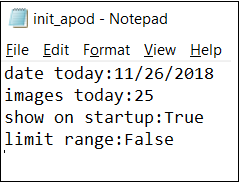

> [!NOTE]
> By naming our settings to be human readable, we are able to validate the app is working correctly, even though the ultimate use of the init file does not require that it is ever read by a human.

6. The more complex of the operations is to read the init file in. Reading the init file is called from the **MainWindow** constructor, so add this line at the end of the method.

```cs           
        public MainWindow()
        {
            InitializeComponent();

            // Set the maximum date to today, and the minimum date to the date APOD was launched.
            MonthCalendar.DisplayDateEnd = DateTime.Today;
            MonthCalendar.DisplayDateStart = launchDate;

            // Store the init file in the same folder as the application.
            initFilePath = System.IO.Path.Combine(AppDomain.CurrentDomain.BaseDirectory, "init_apod.txt");

            // Read the init file and set UI fields.
            ReadInitFile();
        }
```

7. Reading the init file takes a bit of work. Copy and paste in the following method, and read through the comments. Note how each setting string is parsed, and the appropriate UI elements updated. Of course, when the app is first run there is no init file, so we must handle the setting of initial defaults. Finally we display the number of images downloaded today in the UI text box, and trigger a date-selected event if we need to render today's image.

```cs
        private void ReadInitFile()
        {
            // Check that we have an init file.
            if (File.Exists(initFilePath))
            {
                String line = null;
                String[] part;
                bool isToday = false;

                using (var sr = new StreamReader(initFilePath))
                {
                    while ((line = sr.ReadLine()) != null)
                    {
                        // Split the line into the part before the colon (the name), and the part after (the value).
                        part = line.Split(SettingDivider);

                        // Switch on the "name" part, and then process the "value" part.
                        switch (part[0])
                        {
                            // Read the date, and if it is today's date, reach the number of images we have downloaded.
                            // If it is not today's date, set the number of downloads back to zero.
                            case SettingToday:
                                var dt = DateTime.Parse(part[1]);
                                if (dt.Equals(DateTime.Today))
                                {
                                    isToday = true;
                                }
                                break;

                            case SettingImageCountToday:

                                // If the last time the app was used was earlier today, then the 
                                // image count stored is valid against the 50 per day maximum.
                                if (isToday)
                                {
                                    imageCountToday = int.Parse(part[1]);
                                }
                                else
                                {
                                    imageCountToday = 0;
                                }
                                break;

                            case SettingShowOnStartup:
                                ShowTodaysImageCheckBox.IsChecked = bool.Parse(part[1]);
                                break;

                            case SettingLimitRange:

                                // This might invoke a call to LimitRangeCheckBox_CheckedChanged.
                                LimitRangeCheckBox.IsChecked = bool.Parse(part[1]);
                                break;

                            default:
                                throw new Exception("Unknown init file entry: " + line);
                        }
                    }
                }
            }
            else
            {
                // No init file exists yet - so set defaults.
                imageCountToday = 0;
                ShowTodaysImageCheckBox.IsChecked = true;
                LimitRangeCheckBox.IsChecked = false;
            }

            ImagesTodayTextBox.Text = imageCountToday.ToString();

            // Invoke a call to retrieve a picture on start up, if required by the setting.
            if (ShowTodaysImageCheckBox.IsChecked == true)
            {
                // Note in WPF this fires a double event, the first of which should be ignored.
                ignoreDoubleEvent = true;
                MonthCalendar.SelectedDate = DateTime.Today;
            }
        }
```

8. Now back to the fun side of programming!

#### 9. Test the completed WPF program

1. Build and run the completed app. 

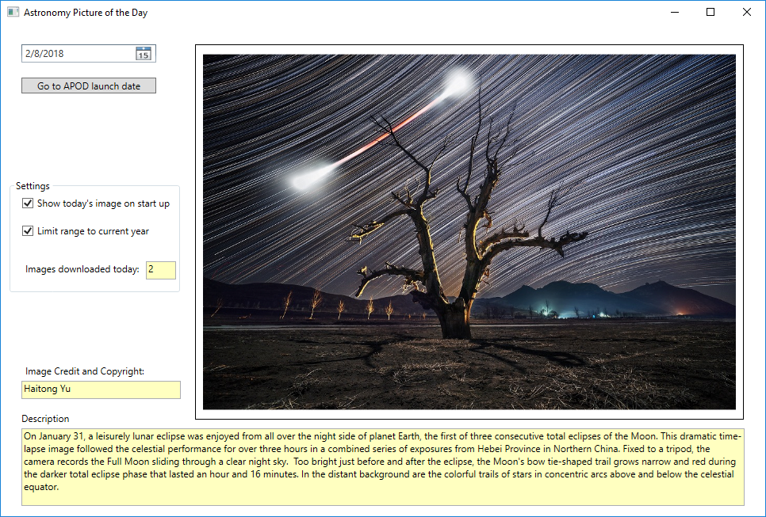

2. Change some of the settings, close the app, and open and run it again. Are the settings preserved correctly? Is the count of images downloaded correct?

3. Check out some of the amazing astronomy photography by selecting dates at random or perhaps dates of special meaning to you. Wonderful stuff! 

And great job completing the tutorial.

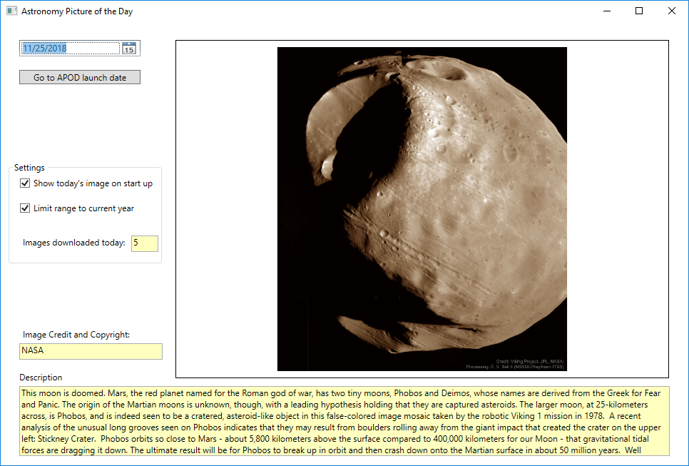

::: zone-end


::: zone pivot="uwp"

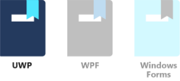

#### 1. Create the Project

1. With Visual Studio 17 opened, create a UWP C# project. Give the project a meaningful name, something like **APOD_UWP**.

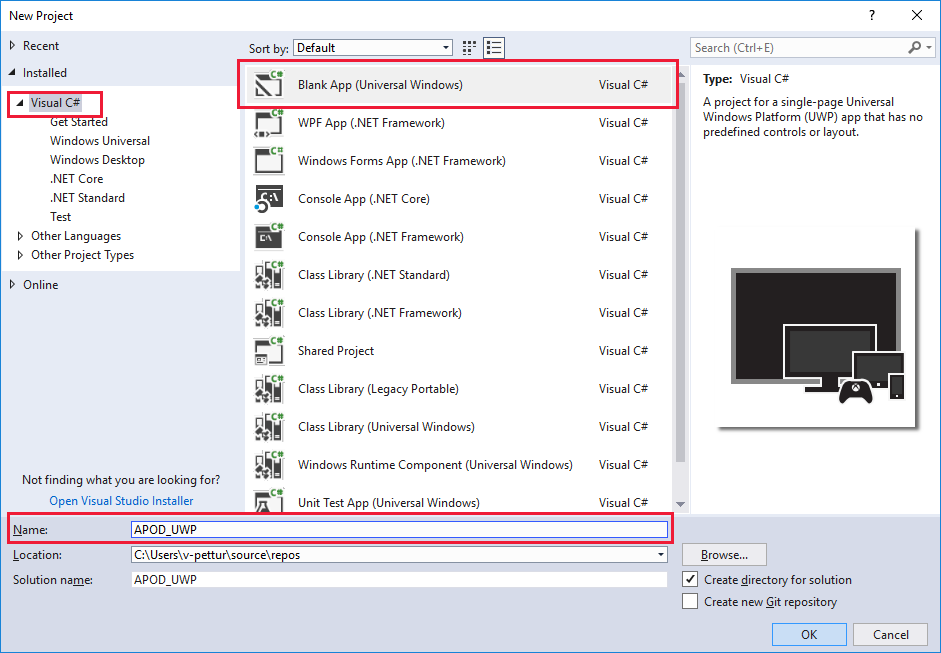

2. Just select **OK** when presented with the puzzling minimum version dialog box.

#### 2. Install the required packages

1. Re-inventing the wheel (in our case, writing code that has been written many times before) is not smart, so let's download an add-on package for Visual Studio that will help us parse the response when we make HTTP calls. A popular add-on for this is from Newtonsoft, so open up **Tools > NuGet Package Manager > Manage NuGet Packages for Solution**. This will show the list of _installed_ packages.


2. Select **Browse** to bring up the list of available packages. Select **Newtonsoft.Json** so it is highlighted, select the check box for your project in the right hand pane, and then select **Install**.


#### 3. Build the UI

The goal of this section is to layout the UI components, and give them a quick test. We need to construct a UI similar to the following:

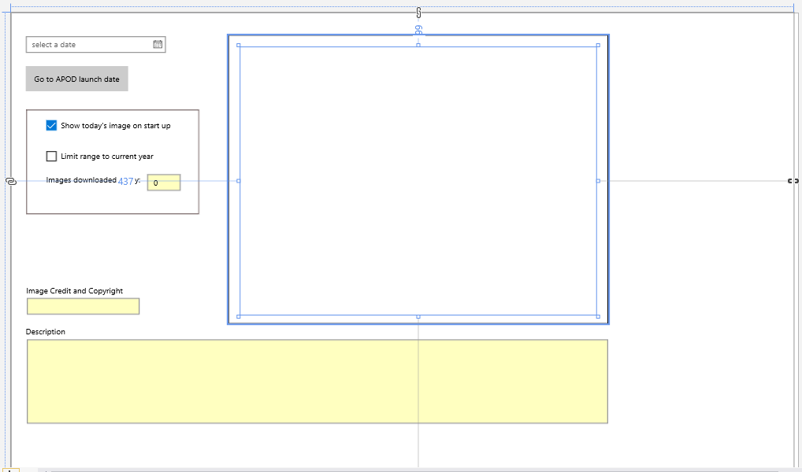

1. Start by opening up the **Toolbox** and expanding **All XAML Controls**. Locate the **CalendarDatePicker** element and drag it to the top left-hand location of the designer layout. In its **Properties** change its name to **MonthCalendar**.

> [!NOTE]
> Be careful not to confuse the **CalendarDatePicker** with the **DatePicker** UI elements. They are different controls with a different set of properites.


2. Below the date picker add a **Button**, change its name to **LaunchButton**, and change its **Content** property (in the **Common** category) to **Go to APOD launch date**. 

3. Now add, below the button, a **Border**. No need to give it a name as we are not accessing it, but change all of the **BorderThickness** properties (in the **Appearance** category) to **1**. This border contains the settings that will be preserved from one run of the app to the next. Expand the border so that it can take several lines of entries, but no need to be precise on this, you can align it precisely after adding the content.

4. Drag a **CheckBox** to within the border, change its name to **ShowTodaysImageCheckBox** and change its **Content** property (again in the **Common** category) to **Show today's image on start up**.

5. Drag a second **CheckBox** to within the border, change its name to **LimitRangeCheckBox** and its **Content** property to **Limit range to current year**.

6. Now add a **TextBlock**, still within the border. No need for a name, but change the **Text** property (in the **Common** category) to **Images downloaded today:**.

7. To the right of the text block, add a small **TextBox**, name it **ImagesTodayTextBox**. This text is certainly read-only, so in the **Common** category of the properties, select the **IsReadOnly** check box. Now, open up the **Brush** category and select the **Background**, and change its color to **255,255,192,100%**. This will give a good contrasting light yellow color as background for the black text, hinting that the text box is read-only. We will do the same for the other read-only text boxes that we need to add shortly.

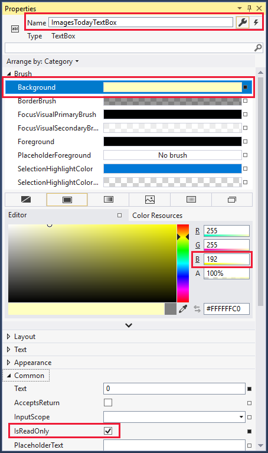

8. Adjust the alignment of the check boxes, text block and text box so that they all fit neatly inside the border, similar to the layout shown at the start of this section.

9. It is important to credit the downloaded images with the correct name and copyright. So add another text block/text box pair, underneath the border. The text block **Text** should be changed to **Image Credit and Copyright:**. The text box should be named **ImageCopyrightTextBox**. It should be expanded to a width that will allow most credits to show without scrolling, so perhaps place it below the text block and expand it to the width of the border above it. Finally, repeat the read-only procedure we did above: setting the **IsReadOnly** property, and the background brush color to light yellow.

10. Now add the third text block/text box pair. The text block should simply say **Description:**. The text box should be expanded to nearly the full width of the layout, and be several lines in height. Name the text box **DescriptionTextBox**, and again set its read-only properties. Also, set its **TextWrapping** property (find this by expanding the **Text** category) to **Wrap**.

11. To make it easier to lay out all the elements neatly, drag a **Border** element to the layout and expand it to a good width and height. In the **Appearance** category, make sure all **BorderThickness** entries are set to **1**. In this case we will name the border, something like **PictureBorder**.

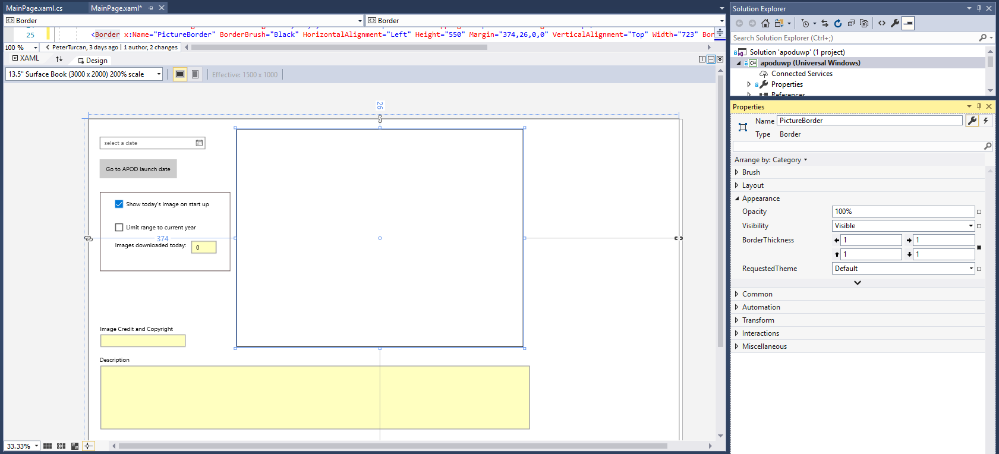

12. Now, with the border selected, drag an **Image** element from the toolbox into the border. This will align the image correctly within the border. Name the image **ImagePictureBox**. If you have difficulty selecting the image instead of the border, right click anywhere inside where the image should be, and select the **Set Current Selection** menu item. This is why we named the border, so both image and border show up clearly in this menu, and you can select the one you are working on.

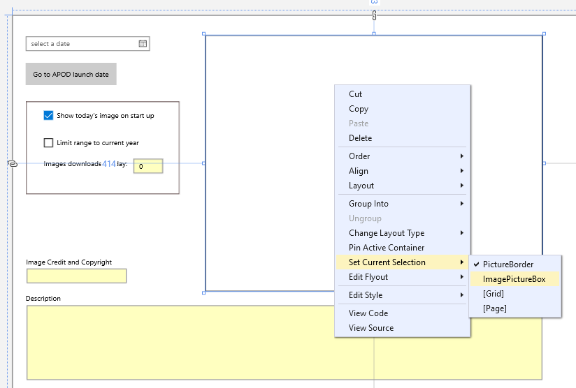

13. On the **Debug** menu, select **Start Without Debugging**. Nothing will work of course, but you will get the chance to view and tidy up the UI elements accordingly. Making the UI as neat as possible is good practice.

#### 4. Add code to handle the UI elements

Only a few of our UI elements need to have events associated with them. Let's work through them one by one. Open up the MainPage.xaml.cs file.

1. Before we enter any events, lets add a few global values that are going to be useful. Add the endpoint needed to call the NASA service, the launch date of the APOD program, and a count of images downloaded, and lets set a couple of defaults on the range of dates available to the calendar. The first section of your **MainPage** class should read.

```cs
    public sealed partial class MainPage : Page
    {
        // The objective of the NASA API portal is to make NASA data, including imagery, eminently accessible to application developers. 
        const string EndpointURL = "https://api.nasa.gov/planetary/apod";

        // June 16, 1995  : the APOD launch date.
        DateTime launchDate = new DateTime(1995, 6, 16);

        // A count of images downloaded today.
        int imageCountToday;

        public MainPage()
        {
            this.InitializeComponent();

            // Set the maximum date to today, and the minimum date to the date APOD was launched.
            MonthCalendar.MinDate = launchDate;
            MonthCalendar.MaxDate = DateTime.Today;          
        }
    }
```

2. In the design view, double-click on the button we named **LaunchButton**, or, in the events for this button, select the **Click** event. Either way, the **LaunchButton_Click** method will be created, and the MainPage.xaml.cs code file opened up to show it.

3. Insert the body of the **LaunchButton_Click** method. It sets the selected date of the calendar to the launch date of the APOD program, but first sets the **LimitRangeCheckBox** to false, which it may be already, just to ensure the full range of dates is available in the calendar. Setting this check box to false just keeps things consistent. The launch date of the program should only be available if the date range available is not restricted to the current year.

```cs
        private void LaunchButton_Click(object sender, RoutedEventArgs e)
        {
            // Make sure the full range of dates is available.
            LimitRangeCheckBox.IsChecked = false;

            // This will not load up the image, just sets the calendar to the APOD launch date.
            MonthCalendar.Date = launchDate;
        }
```

4. Now enter the code for the **LimitRangeCheckBox**. This code should change the range of dates available in the calendar from the full history of the program to just the current year. Open up the events for this check box (by selecting the events icon in the **Properties** pane). Find the **Checked** and the **Unchecked** events (this is different from the WPF and Windows Forms technologies, where these events are combined into one), and select them. This will add the outlines of the two event methods, so add the content shown below.

```cs
        private void LimitRangeCheckBox_Checked(object sender, RoutedEventArgs e)
        {
            // Set the calendar minimum date to the first of the current year.
            var firstDayOfThisYear = new DateTime(DateTime.Today.Year, 1, 1);
            MonthCalendar.MinDate = firstDayOfThisYear;
        }

        private void LimitRangeCheckBox_Unchecked(object sender, RoutedEventArgs e)
        {
            // Set the calendar minimum date to the launch of the APOD program.
            MonthCalendar.MinDate = launchDate;
        }
```

4. The last event we need is to react to is the important one: a date being selected in the **MonthCalendar**. Open up the events for this and select the **DateChanged** event. This will create the following method (leave it empty for now).

```cs
        private void MonthCalendar_DateChanged(CalendarDatePicker sender, CalendarDatePickerDateChangedEventArgs args)
        {

        }
```

5. Before going any further, let's test what we have done. 

#### 5. Test that the UI elements work

We are going to test what we can so far. Firstly we are going to test that selecting the **LimitRangeCheckBox** does limit the range of dates available in the calendar correctly, and then we are going to test that selecting a date in the calendar calls the right event. We can also check that selecting any other UI element does _not_ fire any events!

1. In the **Debug** menu, select **Start Debugging**. When the app runs, go to the calendar and get savvy with all the options available to you. You can select a date. You can also change months and years by selecting the top line of the calendar. Try changing to years and going back as far as you can. It should stop at 1995. The calendar is quite an impressive UI element. It has lots of features all working and no extra code that you need to add. 

2. Now check the **Limit range to current year** check box. Go back and play with the calendar. You should notice that you now cannot go back beyond the first of the year. Now uncheck that check box and ensure you can now go back to 1995.

3. In the **MonthCalendar_DateChanged** event, set a break point on the first "{". Do this by right-clicking on that line of code, and selecting **Breakpoint > Insert Breakpoint** from the menu. If you have got it right, a red circle will appear to the left of the line number.

4. Now back in the app, select any selected date in the calendar. This should stop the program at the breakpoint. Select **Continue** from the **Debug** menu when you have verified the program has correctly halted on the event. Try this with a couple of dates, then we are done. Select **Stop Debugging** from the **Debug** menu. The UI test is now over. Now we want something way more exciting than this to happen when we select a date!


#### 6. Add code to download an image

1. Now we need to be sure we have all the resources available to us. Remember we installed the Newtonsoft package, and we are going to need to call some HTTP functions too. Make sure your list of **using** statements at the top of the MainPage.xaml.cs file includes all of the following.

```cs
using System;
using System.IO;
using Windows.UI.Xaml;
using Windows.UI.Xaml.Controls;
using Windows.UI.Xaml.Media.Imaging;
using Newtonsoft.Json.Linq;
using System.Net.Http;
using System.Net.Http.Headers;
using System.Threading.Tasks;
```

2. Next we need to do a little bit of research. We know that the APOD is an image, but it can also be video (a scenario we are not going to support). However, there are quite a few image formats out there. By researching those available in UWP, we can add a test to ensure a downloaded image is in a supported format. Add the following method to your class. All it does is extract the extension from a URL, and return true if that extension is supported.

```cs
        private bool IsSupportedFormat(string photoURL)
        {
            // Extract the extension and force to lower case for comparison purposes.
            string ext = Path.GetExtension(photoURL).ToLower();

            // Check the extension against supported UWP formats.
            return (ext == ".jpg" || ext == ".jpeg" || ext == ".png" || ext == ".gif" ||
                    ext == ".tif" || ext == ".bmp" || ext == ".ico" || ext == ".svg");
        }
```

3. Now we add the real meat of the program: the method to retrieve an image. This is a somewhat involved method. First note that it is coded as an asynchronous **Task**. Read through the comments in the code to understand the flow, or at least, begin to understand it!

```cs
        private async Task RetrievePhoto()
        {
            var client = new HttpClient();
            JObject jResult = null;
            string responseContent = null;
            string description = null;
            string photoUrl = null;
            string copyright = null;

            // Set the UI elements to defaults
            ImageCopyrightTextBox.Text = "NASA";
            DescriptionTextBox.Text = "";

            // Build the date parameter string for the date selected, or the last date if a range is specified.
            DateTimeOffset dt = (DateTimeOffset)MonthCalendar.Date;

            string dateSelected = $"{dt.Year.ToString()}-{dt.Month.ToString("00")}-{dt.Day.ToString("00")}";
            string URLParams = $"?date={dateSelected}&api_key=DEMO_KEY";

            // Populate the Http client appropriately.
            client.BaseAddress = new Uri(EndpointURL);
            client.DefaultRequestHeaders.Accept.Add(new MediaTypeWithQualityHeaderValue("application/json"));

            // The critical call: sends a GET request with the appropriate parameters.
            HttpResponseMessage response = client.GetAsync(URLParams).Result;

            if (response.IsSuccessStatusCode)
            {
                // Be ready to catch any data/server errors.
                try
                {
                    // Parse response using Newtonsoft APIs.
                    responseContent = await response.Content.ReadAsStringAsync();

                    // Parse the response string for the details we need.
                    jResult = JObject.Parse(responseContent);

                    // Now get the image.
                    photoUrl = (string)jResult["url"];
                    var photoURI = new Uri(photoUrl);
                    var bmi = new BitmapImage(photoURI);

                    ImagePictureBox.Source = bmi;

                    if (IsSupportedFormat(photoUrl))
                    {
                        // Get the copyright message, but fill with "NASA" if no name is provided.
                        copyright = (string)jResult["copyright"];
                        if (copyright != null && copyright.Length > 0)
                        {
                            ImageCopyrightTextBox.Text = copyright;
                        }

                        // Populate the description text box.
                        description = (string)jResult["explanation"];
                        DescriptionTextBox.Text = description;
                    }
                    else
                    {
                        DescriptionTextBox.Text = $"Image type is not supported. URL is {photoUrl}";
                    }
                }
                catch (Exception ex)
                {
                    DescriptionTextBox.Text = $"Image data is not supported. {ex.Message}";
                }

                // Keep track of our downloads, in case we reach the limit.
                ++imageCountToday;
                ImagesTodayTextBox.Text = imageCountToday.ToString();
            }
            else
            {
                DescriptionTextBox.Text = "We were unable to retrieve the NASA picture for that day: " +
                    $"{response.StatusCode.ToString()} {response.ReasonPhrase}";
            }
        }
```

4. There is one more thing we need to do before testing our app so far, and that is to complete the **MonthCalendar_DateChanged** method. Note that we must add the **async** keyword to the method definition, and the use of **await** when making the call. In other words, even though the call is asynchronous, we are going to wait for the result before proceeding.

```cs
        private async void MonthCalendar_DateChanged(CalendarDatePicker sender, CalendarDatePickerDateChangedEventArgs args)
        {
            await RetrievePhoto();
        }
```

That is all the coding we need to do before our next test.

#### 7. Test that the program downloads and displays an image

Now for the fun part of this tutorial.

1. In the **Debug** menu, select **Start Without Debugging**, and select a date.

2. Did it work? Do you see some wonderful images when you select dates? If not, go back carefully over your code to locate what's gone amiss.

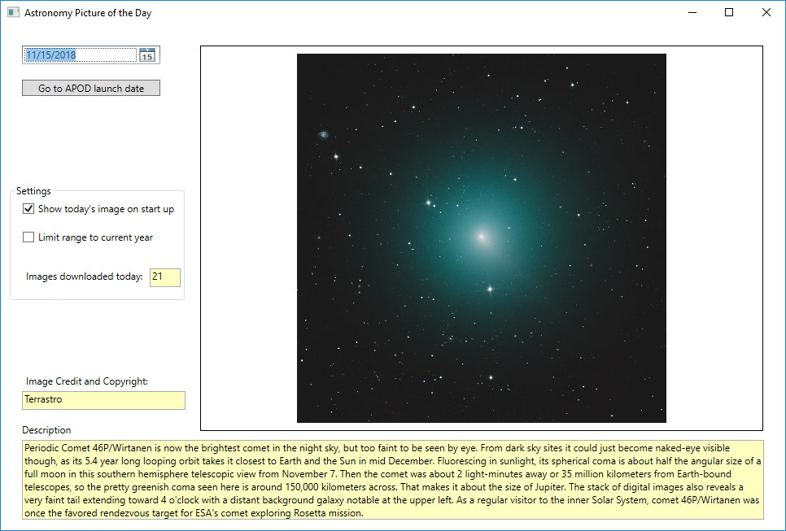


#### 8. Add code to save/restore settings

The next stage is a bit less exciting, though uses technology new to UWP. What we want to do is preserve the user's selections from one run of the app to the next. In this tutorial, we are going to do this by using the **LocalSettings** feature of UWP. Local settings take the place of an init file, they provide convenient local persistent storage, and require many fewer lines of code to implement than using a file.

Apps that do not preserve user preferences can get tedious to use after a while. It is good practice to make your apps user-friendly in this way.

1. The logic for our settings is as follows. We want to give the user the option of _not_ displaying today's astronomy picture on start up, in case they have already seen it and do not want to use up one of their 50 downloads per day. This means we have to save off today's date, the start up setting, and the count of images downloaded today already. We have also added in the setting to limit the range of dates (more as an example of how to save and restore settings than anything else). The first step is to provide name strings for these four settings, so add the following code as globals for your **MainPage** class.

```cs
        // Settings name strings, used to preserve UI values between sessions.
        const string SettingDateToday = "date today";
        const string SettingShowOnStartup = "show on startup";
        const string SettingImageCountToday = "image count today";
        const string SettingLimitRange = "limit range";
```

2. We also need to define a container for the local settings, so add this global too.

```cs
        // Declare a container for the local settings.
        Windows.Storage.ApplicationDataContainer localSettings; 
```

3. Add the following line to the **MainPage()** constructor method, to create the local settings container.

```cs
            // Create the container for the local settings.
            localSettings = Windows.Storage.ApplicationData.Current.LocalSettings;
```

4. Let's now think about how these settings are written out. We need to add an event when the app is closed. Do this by selecting the grid in the design view (do this by right-clicking anywhere on the layout, selecting **Set Current Selection**, and then picking **[Grid]** from the list). This will bring up the grid properties. Select the event icon, then select the **LostFocus** event. This will add skeletal code for an event called **Grid_LostFocus**. The only code that's needed in this event is to call a method to write out the settings.

```cs
        private void Grid_LostFocus(object sender, RoutedEventArgs e)
        {
            WriteSettings();
        }
```

5. Now write that method. Notice how easy it is to store values using the local settings feature of UWP.

```cs
        private void WriteSettings()
        {
            // Preserve the required UI settings in the local storage container.
            localSettings.Values[SettingDateToday] = DateTime.Today.ToString();
            localSettings.Values[SettingShowOnStartup] = ShowTodaysImageCheckBox.IsChecked.ToString();
            localSettings.Values[SettingLimitRange] = LimitRangeCheckBox.IsChecked.ToString();
            localSettings.Values[SettingImageCountToday] = imageCountToday.ToString();
        }
```
> [!NOTE]
> By declaring the settings strings as globals for use in both reading and writing the settings, we avoid errors induced by spelling mistakes, punctuation, spacing, and other tedious mistakes that so often lead to an app not working.

5. The more complex of the operations is to read the settings. Reading them is called from the **MainPage** constructor, so add this line at the end of the method.

```cs           
        public MainPage()
        {
            this.InitializeComponent();

            // Create the container for the local settings.
            localSettings = Windows.Storage.ApplicationData.Current.LocalSettings;

            // Set the maximum date to today, and the minimum date to the date APOD was launched.
            MonthCalendar.MinDate = launchDate;
            MonthCalendar.MaxDate = DateTime.Today;

            ReadSettings();            
        }
```

6. Reading the settings takes a bit of work. Copy and paste in the following method, and read through the comments. Note how each setting string is parsed, and the appropriate UI elements updated. Of course, when the app is first run there are no stored settings, so we must handle the initial defaults. Finally we display the number of images downloaded today in the UI text box, and trigger a date-selected event if we need to render today's image.

```cs
        private void ReadSettings()
        {
            // If the app is being started the same day that it was run previously, then the images downloaded today count
            // needs to be set to the stored setting. Otherwise it should be zero.
            bool isToday = false;
            Object todayObject = localSettings.Values[SettingDateToday];

            if (todayObject != null)
            {
                // First check to see if this is the same day as the previous run of the app.
                DateTime dt = DateTime.Parse((string)todayObject);
                if (dt.Equals(DateTime.Today))
                {
                    isToday = true;
                }
            }

            // Set the default for images downloaded today.
            imageCountToday = 0;

            if (isToday)
            {
                Object value = localSettings.Values[SettingImageCountToday];
                if (value != null)
                {
                    imageCountToday = int.Parse((string)value);
                }
            }
            ImagesTodayTextBox.Text = imageCountToday.ToString();

            // Set the UI checkboxes, depending on the stored settings or defaults if there are no settings.
            Object showTodayObject = localSettings.Values[SettingShowOnStartup];
            if (showTodayObject != null)
            {
                ShowTodaysImageCheckBox.IsChecked = bool.Parse((string)showTodayObject);
            }
            else
            {
                // Set the default.
                ShowTodaysImageCheckBox.IsChecked = true;
            }

            Object limitRangeObject = localSettings.Values[SettingLimitRange];
            if (limitRangeObject != null)
            {
                LimitRangeCheckBox.IsChecked = bool.Parse((string)limitRangeObject);
            }
            else
            {
                // Set the default.
                LimitRangeCheckBox.IsChecked = false;
            }

            // Show today's image if the check box requires it.
            if (ShowTodaysImageCheckBox.IsChecked == true)
            {
                MonthCalendar.Date = DateTime.Today;
            }
        }
```

7. Now back to the fun side of programming!

#### 9. Test the completed UWP program

1. Build and run the completed app. 

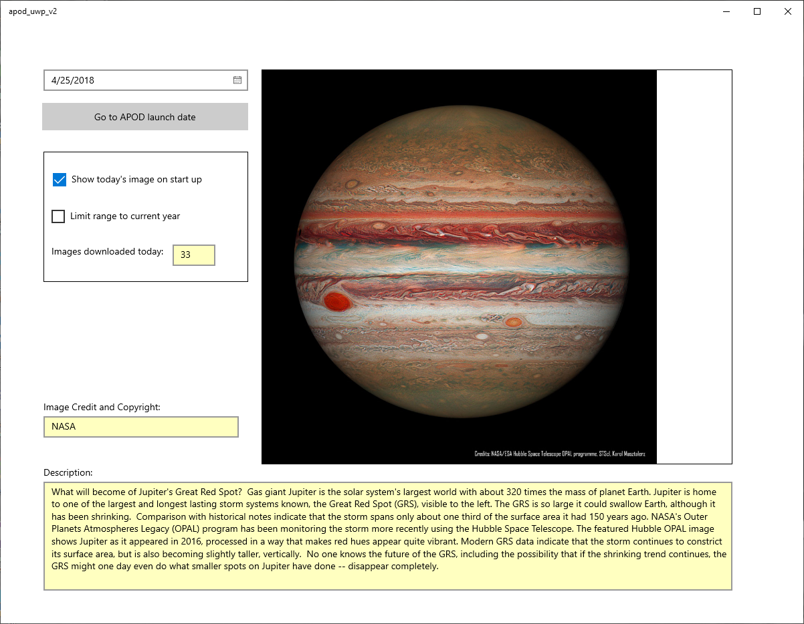

2. Change some of the settings, close the app, and open and run it again. Are the settings preserved correctly? Is the count of images downloaded correct?

3. Check out some of the amazing astronomy photography by selecting dates at random or perhaps dates of special meaning to you. Wonderful stuff! 

And great job completing the tutorial.

::: zone-end

### Summary

If you are interested, try this tutorial using one of the other UI technologies. In this way you will find out which you prefer. UWP is the latest, and has some great features (such as the persistent local settings feature we used in this tutorial). Windows Forms is certainly tried, tested, and robust. WPF has some great features, and some quirks too, as you will have noticed if you tried that tutorial.
