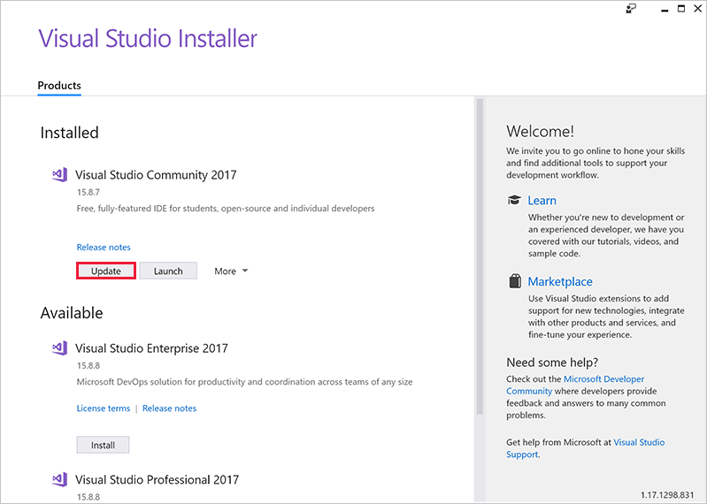
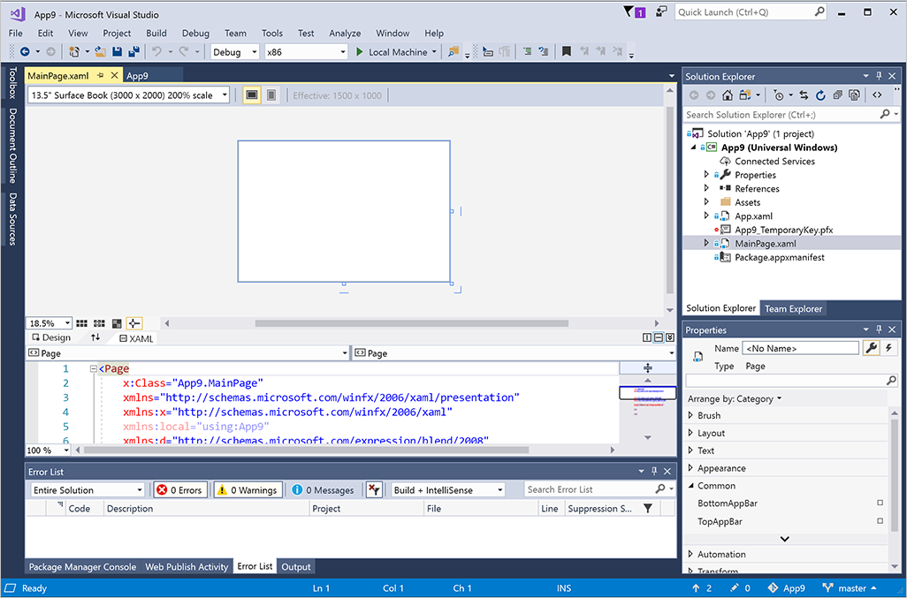
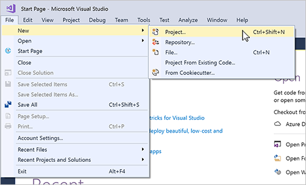
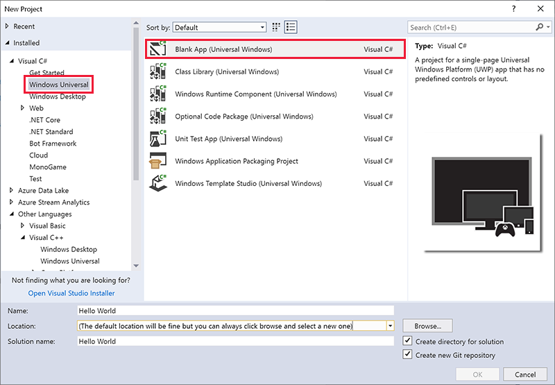
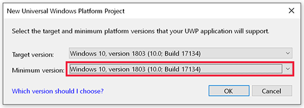
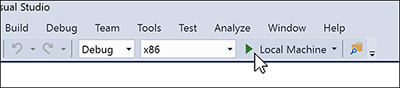
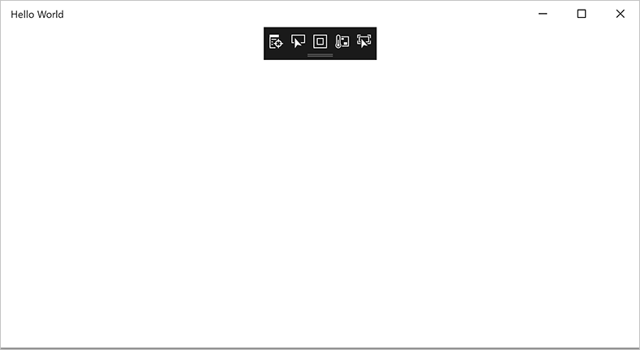

## Welcome to Visual Studio

> [!VIDEO https://www.microsoft.com/en-us/videoplayer/embed/RE2MhKX]

Visual Studio is a complete Integrated Development Environment (IDE) used to develop applications for Windows, the web, and other platforms. It consists of a source code editor, designer, compiler, and debugger.

There are three versions of Visual Studio 2017: Community, Professional and Enterprise. Visual Studio Community is free, and it's the version that this module will use. If you're using a different version, you might find the screen images look slightly different.

You can download and install Visual Studio directly from the [Visual Studio](http://www.visualstudio.com) website. For more complete instructions and some automated scripts to make it even easier, check out the Introduction to Windows 10 module.

> [!NOTE]
> Don't confuse Visual Studio with Visual Studio Code. [Visual Studio Code](https://code.visualstudio.com) is a standalone editor.
>
> There is also Visual Studio for Mac. This module does not cover Mac development, so please see [Visual Studio for Mac](https://visualstudio.microsoft.com/vs/mac/) for more information.

## Install or update Visual Studio

Before you start this module, you need to have Visual Studio installed. If you've already installed Visual Studio, it's a good idea to make sure you are using the very latest release by running the **Visual Studio Installer** app.

1. From the Start menu, select **Visual Studio Installer**.

1. If the **Update** button is displayed, as in the image below, select it. Visual Studio will download and install any updates.

## Some definitions

### Project

Your first apps will consist of a single *project*. Your project will consist of your source code (for example, C# and XAML), any resources your app needs (images or sounds), and other Visual Studio information.

### Solution

A *solution* can encompass more than one project. Why? Perhaps your app makes use of another project to provide some key functionality. Or perhaps your app runs on different types of devices and needs to be built in slightly different ways. A solution brings all these projects together into one place.

### Intellisense

IntelliSense is a term for a set of features that displays information about your code directly in the editor and, in some cases, writes small bits of code for you. It's like having basic documentation inline in the editor, which saves you from having to look up everything elsewhere.

## A quick tour of Visual Studio

Here's a look at the Visual Studio UI with a solution open:

*Solution Explorer* (top right) lets you view, navigate, and manage your code files. Solution Explorer can help organize your code by grouping the files into solutions and projects.

The *editor window* (center), where you'll likely spend a majority of your time, displays file contents. This is where you can edit code or design a user interface such as a window with buttons and text boxes.

*The Output window* (bottom center) is where Visual Studio sends notifications such as debugging and error messages, compiler warnings, publishing status messages, and more. Each message source has its own tab.

*Team Explorer* (bottom right) lets you track work items and share code with others using version control technologies such as Git.

This view shows C# code, but the editor window is also where you can design the appearance of your app. If you were to click on a XAML file (for example, **MainPage.xaml**), the editor would change to show something similar to this:

This shows the preview of your UI in the upper window, and the XAML used to define it underneath. You can toggle between views by using the arrow button in the border between the Design and Code views by the words **Design** and **XAML**. When you make changes in the XAML file, the preview will change and vice versa.

From this view, you can open the Toolbox (on the far left) and select controls to drag-and-drop into your app's window.

> [!Important]
> If you make a change to the XAML that violates the formatting rules (for example, if you mistype the name of a control, or leave out a closing '>' symbol), the design view will display an **Invalid Markup** message and be unable to display the preview. If you don't immediately see a way to fix this mistake, you can step back (**Edit** > **Undo**) until the preview is working again.

## Creating a new project with Visual Studio

Now that you have Visual Studio ready and waiting to go, let's quickly create a new project to test everything.

1. Open Visual Studio.

2. Create a new project by selecting  **File** > **New** > **Project**.

   

3. From the list of new project types, select **Installed** > **Visual C#** > **Windows Universal** > **Blank App (Universal Windows)**.

   

4. Enter **Hello World** for the name of your app. The *Location* and *Solution name* defaults don't need to be changed.

5. Select **OK**.

6. You'll be asked to set the **Target version** and **Minimum version** for your app. For the exercises to come, it's important you set the **Minimum version** to **Windows 10, version 1803** or later.

  

7. Your project will be created. The project won't be entirely empty: some files and settings will be created for you.

8. Make sure the settings are the same as shown below, and select the green **Run** button in the middle of the menu bar to build and launch your app (or press **F5**).

   

9. Soon you will see an empty window appear. This is your app running. (The small black rectangle with icons at the top of your app's window is added by Visual Studio to help debugging. It won't be in your final app).

   

10. Stop your app running by clicking the red square in the menu bar.