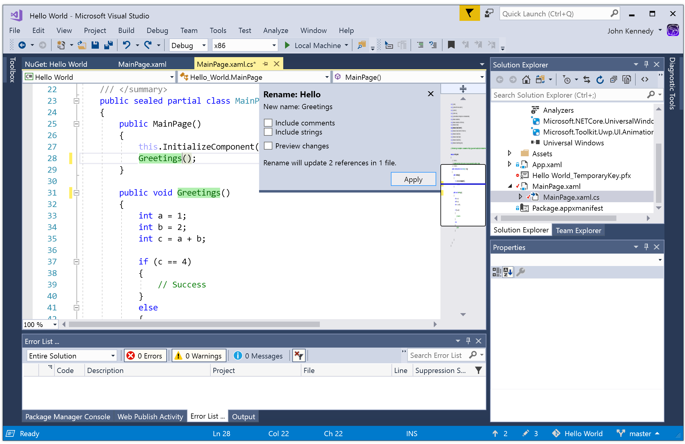
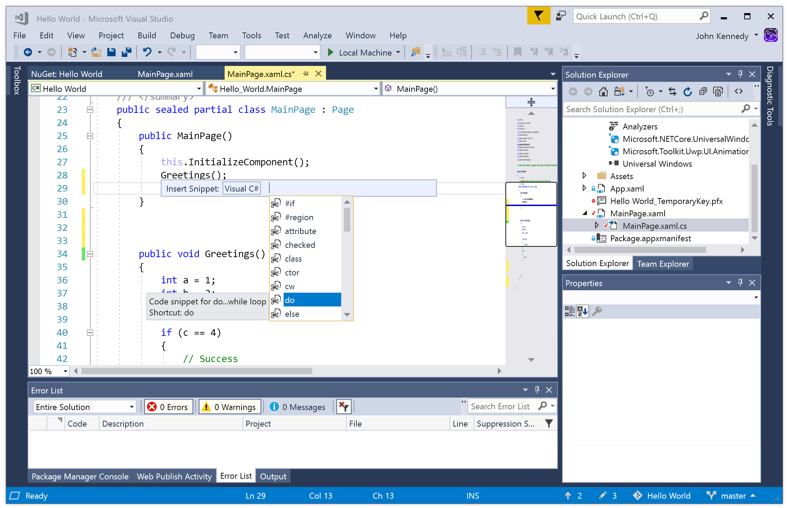
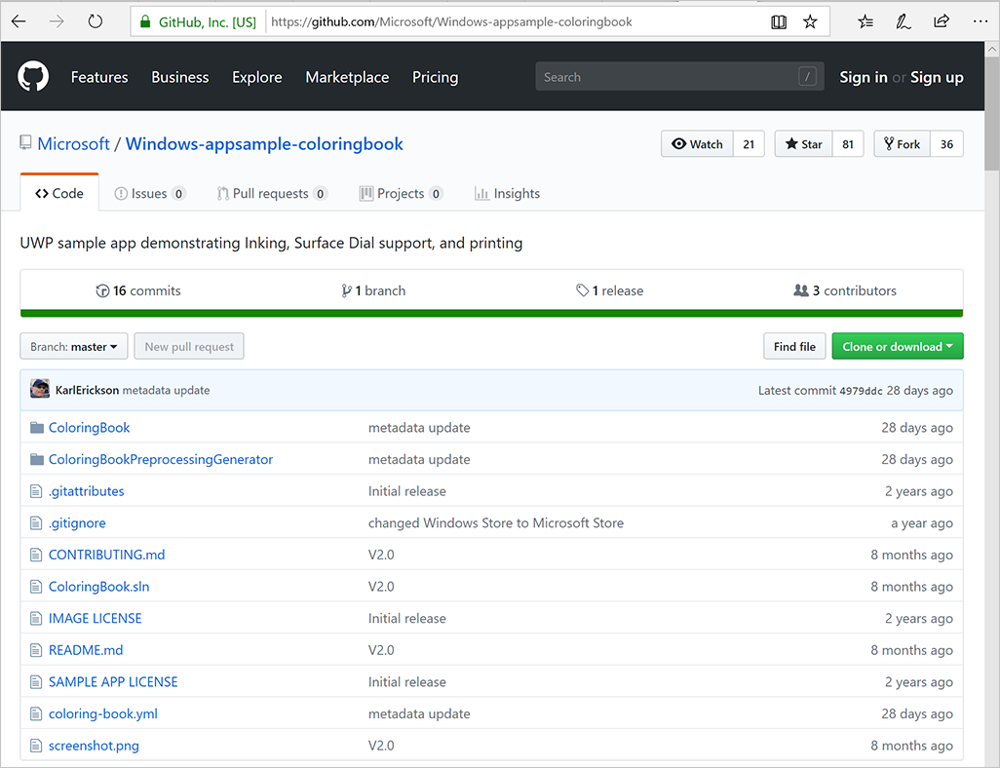
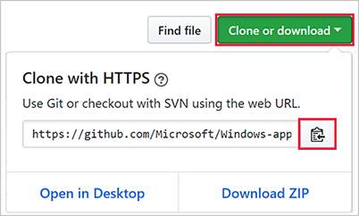
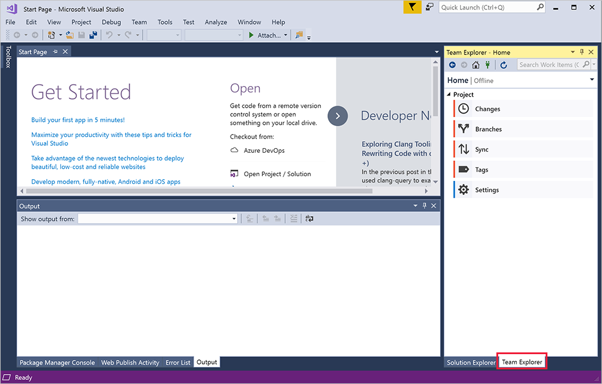
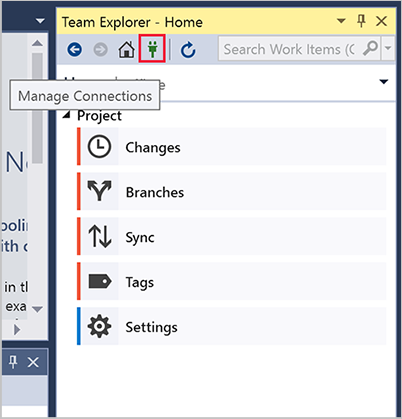
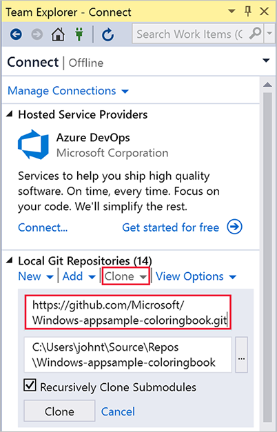
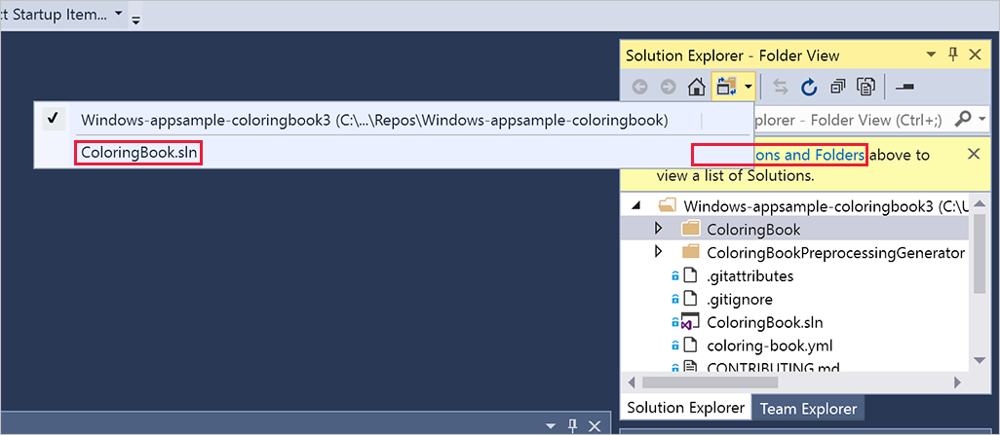

It could take years to master all that Visual Studio has to offer, but here's a quick review of some highlights you might find useful.

## Themes

The Visual Studio IDE can switch between light themes, dark themes and lots of variations in-between. Let's try switching to a dark theme:

1. On the menu bar, select **Tools** > **Options**.

1. On the **Environment** > **General** options page, change the **Color theme** selection to **Dark**, and then select **OK**.

Like it? If not, try some others! 

## Refactoring

Visual Studio has powerful refactoring tools that allow you to apply changes to your source code in an intelligent way. For example, you can highlight a piece of code, and then use the refactoring tool to extract it and turn it into a method. The refactoring tool is also great for renaming variables.

Try it out on the project you created in the previous unit.

1. Open the **MainPage.xaml.cs** file by selecting it in the **Solution explorer**.

2. Hover over the method called **Hello()** in **MainPage()**.

3. Right-click and select **Rename...** from the list.

4. With the **Rename** window visible, type a new name and select **Apply**. Notice how the name changes everywhere it has been used.

## Code snippets

Code snippets are predefined pieces of code that Visual Studio can add to your project for you. Once you get to know them, they can save you a lot of typing.

Let's use a snippet to quickly add a **do/while** loop to our project.

1. Open the **MainPage.xaml.cs** file by clicking on it in the **Solution explorer**.

2. Make a newline in the **MainPage()** method.

3. Press Ctrl K and X to open the **Insert Snippet** pop-up.

4. Select **Visual C#** and **do** from the list.
 

5. Now you can enter any missing information: for example, the **do** loop requires a condition — if it's true, the loop will continue.

## GitHub

GitHub is a service and website that is used to store code projects, including those created by Visual Studio. There are many advantages to using GitHub, including:

* Security. Your code is stored remotely (what if something bad happened to your own computer?)
* Source Code Management. GitHub uses Git which means it's easy to "undo" or to try new ideas.
* Sharing. Best of all, GitHub makes it easy to share and collaborate on projects, and to use other developer's code.

Here's how to download a project from GitHub directly into Visual Studio:

1. First, let's find the example project in GitHub. Select the [Windows coloring book sample here](https://github.com/Microsoft/Windows-appsample-coloringbook) to open the correct project in GitHub.

1. Look for the green **Clone or Download** button and select it. The URL for the project is listed. Select the clipboard icon to copy it.

2. Now open Visual Studio. In the column on the right, select the **Team Explorer** tab.

3. Select the **Manage Connections** icon.

4. Under **Local Git Repositories**, select **Clone**. Paste in the URL path to the upper box, where the **Enter the URL of a Git repo to clone** prompt is displayed.

5. If necessary, change the default location listed underneath the path you just entered. This is where your local copy of the project will be stored.

6. Select **Clone**.

The solution will be cloned (downloaded) to your computer. Be aware that loading a project in this way may not set the default project. As a Visual Studio solution may contain multiple projects, Visual Studio may not realize that you want *this* particular project to be the one that is built and launched. You will have to set that option manually.

7. Select the link to **Solutions and Folders**, and then select **ColoringBook.sln**.

8. Select the Run button

Visual Studio may want to download additional components. Once you confirm this, the app will build.  

### ARM or x86 or x64?

Visual Studio can build apps for many types of hardware, including Advanced RISC Machine (ARM)-based systems, and computers running both 32 bit and 64 bit versions of Windows. When you load a project from GitHub, the default value for this system architecture might be incorrect. For example, it might default to ARM when you have an Intel-based computer. Make sure that the architecture listed beside the **Run** button matches your hardware: usually this will be set to **x86**.

### Other ways to use GitHub

You can also download a project from GitHub as a zip file. You would then un-archive it and open it directly in Visual Studio. This is a good approach if you don't think you're ever going send improvements back to the project or share versions with other developers on GitHub.

### Using Git on a day-to-day basis

Every developer knows that keeping track of changes to their projects can be difficult. What if you try something out, then realize it was a mistake and need to go back to a previous version? Or what if you are working with a friend and you both make changes to the same files? These situations are exactly what Git is good at managing.