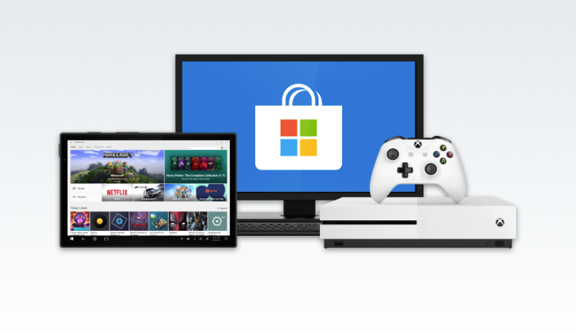

## Welcome to Windows 10 development!

Windows 10 is used on millions of desktop, laptop and tablet computers worldwide. All these devices run apps created using the same tools and frameworks. In this module, you'll learn about the different options for creating Windows 10 apps, their relative strengths, and the tools required to use them. By the time you finish, you'll be ready to start writing your own apps.

> [!VIDEO https://www.microsoft.com/en-us/videoplayer/embed/RE2MpwX]

## Windows 10 apps

Windows 10 can run all kinds of apps, including games, enterprise applications, utilities, mixed reality experiences, and word processors. You name it, Windows can run it. With such a huge number of possibilities, it can be a little overwhelming to know how to even start. That's where we come in. This module will help set the scene and get you comfortable with the tools and platforms at your disposal. You won't be an expert by the time you finish, but you'll at least have an idea about your next steps.



## Windows development tools and platforms

Most developers writing software for Windows use Visual Studio, the development environment that supports code editing, designing, building and debugging. Visual Studio is your toolbox, and where you'll spend your time honing your apps. But you can't create anything with Visual Studio alone, so you'll need to make use of software development kits (SDKs) and platforms such as .NET to make a working app. 

As needs and technologies change over the years, different platforms and frameworks have been created to help developers write apps. Different types of application will use different tools, and different developers will prefer some tools over others. There is no "one size fits all" rule. Instead, we'll explain your choices, then walk you through building an app using some popular options.

## Advice on selecting a platform

Which development platform should you use? Well, that's really up to you. You may already have an application written using Windows Presentation Foundation (WPF), in which case you'll probably want to continue using WPF, as you can now add new features available from the Universal Windows Platform (UWP). If you are starting a new project from scratch, using UWP is an attractive option. With UWP you get immediate access to the latest Fluent Design System components for making modern user interfaces.

This module will include UWP, WPF and Windows Forms examples, but there are other platforms such as [Progessive Web Apps](https://docs.microsoft.com/microsoft-edge/progressive-web-apps/get-started) (PWAs) available.

## Common terms you will hear

### C#

C# is a programming language, perhaps the most popular for developing Windows apps. C# is a modern language with sophisticated features but is still easy enough for a beginner to pick up quickly. Other languages such as Visual Basic, C++ (and WinRT/C++), F#, and JavaScript can also be used. C# looks something like this:

```csharp
void Hello()
{
    Console.WriteLine("Hello, World!");
}
```

If you are completely new to C#, here's a learning course on [C# for Beginners](https://mva.microsoft.com/training-courses/c-fundamentals-for-absolute-beginners-16169).

### XAML

XAML is a markup language used to define user interfaces. XAML is used by several Windows development platforms, and so there are variations in exact syntax and capabilities. XAML can be generated automatically by tools such as the Visual Studio designer or the Blend editor, or even entered manually. You'll see a lot of XAML if you develop with UWP or WPF. XAML looks like a typical XML-based markup language, for example:

```XAML
<Button Context="click me" />
```

### .NET

.NET is a free, cross-platform, open source developer platform for building many different types of applications. With .NET, you can use multiple languages, editors, and libraries to build for web, mobile, desktop, gaming, and the Internet of Things (IoT). .NET Standard is a base set of Application Programming Interfaces (APIs) that are common to all .NET implementations. Bottom line: .NET is a collection of very useful, proven, high-quality features that make your code easier to write and more reliable.

When you write a Windows Forms or WPF app, you're using .NET. UWP has its own similar features but doesn't use .NET by default.

### GitHub

[GitHub](https://www.github.com) is a website and service that can act as a storage place for source code, individual and shared projects, and other forms of content. In practical terms, you can save your projects to GitHub and share them with other developers (a very common scenario with open source projects), or search it for code and tools that will help you. It uses the tool [Git](https://git-scm.com) to manage submissions and dealing with changes from multiple developers.

### Windows Template Studio

[Windows Template Studio](https://marketplace.visualstudio.com/items?itemName=WASTeamAccount.WindowsTemplateStudio) is a Visual Studio extension that accelerates the creation of new UWP apps using a wizard-based experience. The resulting UWP project is well-formed, readable code that incorporates the latest Windows 10 features while implementing proven patterns and best practices. WTS is an [open source project on GitHub](https://aka.ms/wts).

### Windows Community Toolkit

The [Windows Community Toolkit](https://github.com/windows-toolkit/WindowsCommunityToolkit) is a collection of helper functions, custom controls, and app services. It simplifies and demonstrates common developer tasks building UWP apps for Windows 10 and [ships through NuGet](https://www.nuget.org/profiles/Microsoft.Toolkit) for easy consumption for developers.
