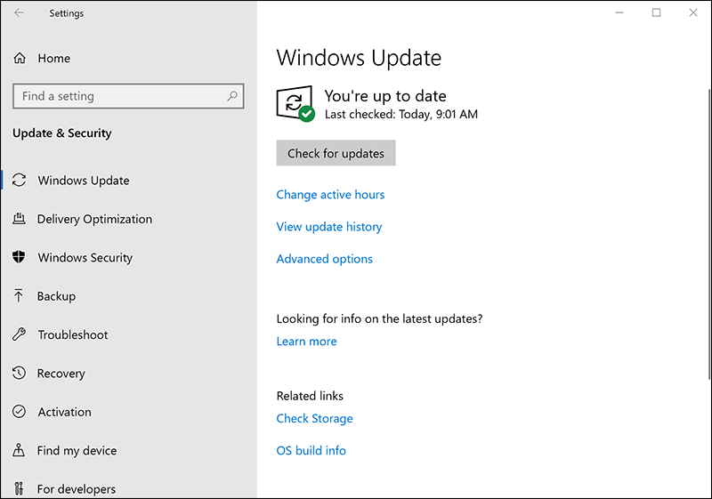
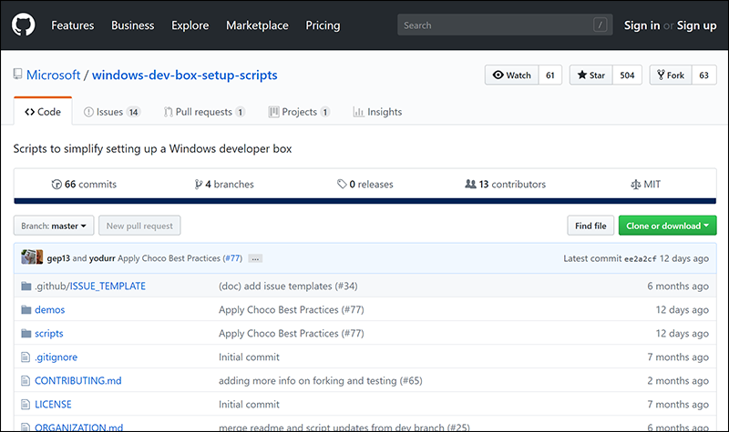
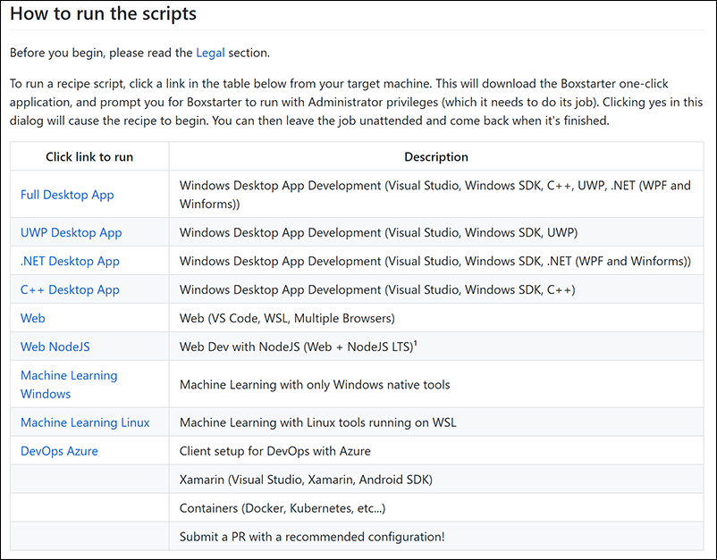

Ready to install Visual Studio? Good! Let's do it. Before you start though, you'll need to make sure that your computer is running the latest version of Windows 10. Then, simply follow a link and the installation will be performed automatically.

## Make sure Windows 10 is up-to-date

First make sure you have the latest version of Windows:

1. Go to **Settings**.
1. Select **Update & Security**.
  
1. Select **Check for updates**.
1. Let any updates install.

## Go to the installation script page on GitHub

1. Using Microsoft Edge, go to [this page on GitHub](https://github.com/Microsoft/windows-dev-box-setup-scripts).
   
1. Scroll down until you see this table.
   
1. Select the link **Full Desktop App**.
1. Follow the instructions.
 
> [!NOTE]
> These installation scripts require the Microsoft Edge web browser to work properly.

## What will the script install

Just in case you're curious, the script will install the following tools:

* Visual Studio 2017 Community edition
* Visual Studio Code
* Git
* The Visual Studio Azure workload
* The Visual Studio UWP workload
* The Visual Studio Managed desktop workload
* The Visual Studio Native desktop workload
* Windows Template Studio
* GitHub UWP samples

It will also turn on developer mode on Windows 10.

## Something didn't work

If something didn't work, or you would rather install the tools yourself, see the next unit to learn how to install the tools manually.