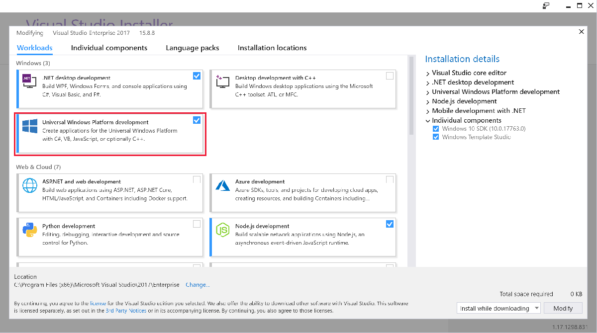
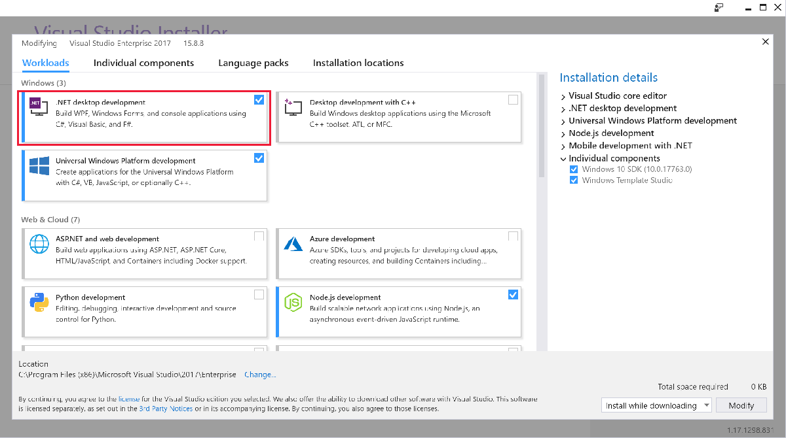
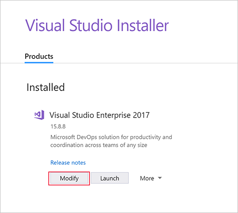
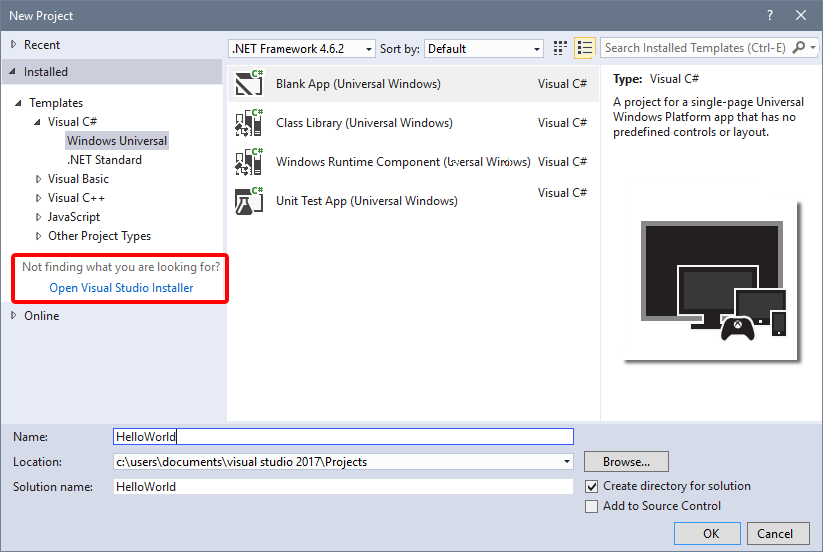

If the automatic process in the previous module isn't for you, here's how to manually install Visual Studio.

> [!NOTE]
> If you have already installed Visual Studio, you can skip this page.

## Downloading Visual Studio

Visual Studio comes in several versions. If you are an experienced developer, you may already be using Visual Studio Professional or Visual Studio Enterprise. These paid versions of the program provide additional features for advanced scenarios. However, all the features you need to develop Windows apps are available in the free Visual Studio Community version.

* [Download Visual Studio](https://go.microsoft.com/fwlink/p/?LinkID=534189)

## Installing Visual Studio

The installation process is handled by the Visual Studio Installer, which will walk you through the process. The default settings provided contain most of what you need. However, during installation, you will be prompted to choose workloads that correspond to the type of Windows apps you want to develop.

Select **Universal Windows Platform development** if you are considering writing UWP apps.

Select **.NET desktop development** if you are considering writing WPF or Windows Forms apps.

More than one option can be selected. Additionally, you can always install additional workloads by launching Visual Studio Installer again.

This can be done via the Start menu, or from the **New project** dialog within Visual Studio.

## Installing the SDK

By default, new installations of the **Universal Windows Platform development** workload in Visual Studio will install the latest version of the Windows 10 software development kit (SDK). If you have already installed the Windows 10 SDK, you can update it in the **Individual components** tab of the Visual Studio Installer.

Alternately, you can [download the latest version of the SDK online](https://developer.microsoft.com/windows/downloads/windows-10-sdk).

We recommend upgrading to the latest SDK version whenever possible. Developing with the latest SDK allows you to use the latest Windows app development features and doesn't prevent you from being able to develop apps for previous versions of Windows 10.

## Other useful tools

* [Windows Template Studio](https://marketplace.visualstudio.com/items?itemName=WASTeamAccount.WindowsTemplateStudio).
* [Git](https://git-scm.com)
