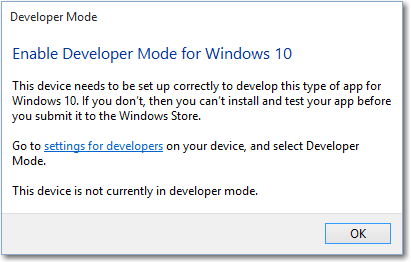

There's one more thing to do before you can write Windows 10 apps on your computer: you must enable Developer Mode on any Windows computer you're using to write apps, and any devices you'll use to test your code. If you've already done so for a previous project, you can skip this step.

> [!NOTE]
> Enabling Developer Mode requires administrator access. If your device is owned by an organization, this option might be disabled. If you cannot activate Developer Mode on your computer, you will need to use a virtual machine to develop Windows apps.

When Developer Mode is not enabled, opening a project in Visual Studio will open the **For developers** page in **Settings**, or cause the following dialog to appear in Visual Studio.

When you see this dialog, select **Settings for Developers** to open **For Developers**.

> [!NOTE]
> You can go to the **For developers** page at any time to enable or disable Developer Mode. It can be accessed in the **Update & Security** tab of **Settings**, or by typing "for developers" into the Cortana search box in the taskbar.

## Enabling Developer Mode

To enable Developer Mode or related settings.

1.  From the **For developers** settings dialog, choose the level of access that you need.
2.  Read the disclaimer for the setting you chose, then select **Yes** to accept the change.

Here's the settings page on the desktop device family.

## Developer Mode features

When you enable Developer Mode on a desktop computer running Windows 10, a package of features is installed. These features include an secure shell (SSH) service that allows remote deployment of apps to your computer, and the Windows Device Portal (WDP). These features will be relevant if you enable device discovery on your computer, or if you develop apps for Internet of Things (IoT) applications. If you're just developing Windows apps, you can safely ignore them. For more information, see [enable your device for deployment](https://docs.microsoft.com/windows/uwp/get-started/enable-your-device-for-development)

### Failure to install

Network or administrative issues might prevent the Developer Mode package from installing properly, preventing the use of remote deployment and the WDP. Even in this case, you can still test and deploy your app locally using Visual Studio.

> [!NOTE]
> If the Developer Mode package doesn't install correctly, we encourage you to file a feedback request. In the **Feedback Hub** app, select **Add new feedback**, and choose the **Developer Platform** category and the **Developer Mode** subcategory. We appreciate your feedback, as it helps Microsoft resolve the issue you encountered.

## Create a developer account

If you want to submit apps or add-ins to the Microsoft Store, you will require a developer account. A developer account has a one-time registration fee with no required renewal and is linked to an existing Microsoft account.

> [!NOTE]
> A developer account is necessary only if you want to distribute your apps in official Microsoft platforms. You can develop Windows apps without one.

To register for a developer account, go to the [registration page](https://developer.microsoft.com/store/register) and select **Sign up.** You will be prompted to log into your Microsoft account (or to create a new one), which will be used to sign in to your developer account. Follow the steps to choose your country, account type, public publisher display name, and contact information.

For a step-by-step walkthrough of the developer account process and in-depth information of the specific account settings, see [Opening a developer account](https://docs.microsoft.com/windows/uwp/publish/opening-a-developer-account).
