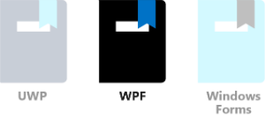

Windows Presentation Foundation (WPF) in Visual Studio provides developers with an API interface for building apps for desktop, notepad and tablet computers. WPF is built on the powerful DirectX graphics system, and provides a lot of great UI features and effects with little programming effort.

In this unit, we will:
- Use Visual Studio to create a new WPF project.
- Add UI and code elements to the project to create a fun variation of a "hello world" program. The "Hello there!" text, and the border, will change color randomly each time the "Say hello" button is clicked.
- Learn how to set properties and create events.

> [!NOTE]
> We're assuming you have set up your computer with Windows 10 and Visual Studio, as detailed in the Learn Module "Introduction to Windows 10 development".

### WPF "Say hello" tutorial

#### Create the project

1. Open Visual Studio and select **File > New > Project** from the menus, and select **Visual C#** as the project language. Next select the **WPF App (.NET Framework)** project, and, in the **Name** field, enter a friendly name such as **Say hello**. Select **OK** when you're ready.


2. When the project opens, it's a good idea to make sure the **Solution Explorer** and **Properties** panes are open. They're located, by default, on the right-hand side of the Visual Studio window. If they aren't visible, open up the **View** menu and select both of these entries to have them displayed.

3. In **Solution Explorer** make sure you can see the names of the two files we will be working on: **MainWindow.xaml** and its *code behind* file, **MainWindows.xaml.cs**. Select **MainWindow.xaml** to open it up.


#### Design the UI

1. Next, if it isn't open already, open up the Toolbox (from the **View** menu again, select **Toolbox**). In the Toolbox, select **Common WPF Controls**.


2. First, drag a **Button** onto the lower part of the designer layout. Then drag a **TextBox** to the upper part of the layout, and drag its corners out a bit so it looks similar to the following.


> [!NOTE]
> Note how button and toolbox entries are added to **&lt;Grid&gt;** in the XAML definition, shown below the layout.

3. Next we want to set some properties on these UI elements. First, select the button so that its properties appear in the **Properties** pane. Change the **Name** to something simple like **SayHelloButton**, and change the **Content** (in the **Common** properties) to read **Say hello**.


4. We need to attach an event to the button. This can be done by selecting the button itself, though this only works if the designer layout is in the required state. A more certain way to enter an event is to open up the events available for that UI item, by selecting the icon shown below in the **Properties** pane, then simply selecting the entry for the **Click** event. This automatically creates the named event **SayHelloButton_Click**, adds the appropriate code entry in the **MainWindow.xaml.cs** file, and opens the file for you.


5. We won't enter any code just yet, so select **MainWindow.xaml** in the main view. We'll keep working on the UI for now.

6. Select the text box element you created in the designer to bring up its properties. We're going to make quite a few changes to the properties for the text box. If the events are showing in the **Properties** pane, select the wrench icon (to the right of the name) to return to the named properties.

7. First change the **Name** entry to **textBox1**, and then, in the **Layout** properties, change **Width** and **Height** to **360** and **80** respectively.


8. Contract the **Layout** entry.

9. In the **Text** dropdown, change the point size to **36**: something nice and visible!


10. Note that the font icon **A** is open by default for the **Text** dropdown. Select the paragraph icon and change the alignment to **Center**.


11. Contract the **Text** entry, and expand **Appearance**. Show all properties by selecting the down arrow (at the bottom of the **Appearance** properties). Change the border thicknesses to **1** for the left and top, and **8** for the right and bottom borders. This is simply to give a bit of a drop shadow effect!


12. Contract **Appearance** and expand **Common**. Now enter the text for the text box: something friendly like **Hello there!**.


We are just about finished with the UI elements for our app, and the **&lt;Grid&gt;** entry in your XAML file should look similar to the following.


> [!NOTE]
> For the record, yes you can edit the XAML directly, changing numerical values or even adding entire UI elements. Doing this is not part of this tutorial.

#### Write the code behind

1. We can now move from the UI to the code for our app. Now is the time to reopen the **MainWindow.xaml.cs** file (do this by selecting its name either above the main view, or in **Solution Explorer**). The **class MainWindow** looks like this.

```csharp
public partial class MainWindow : Window
    {

        public MainWindow()
        {
            InitializeComponent();
        }

        private void SayHelloButton_Click(object sender, RoutedEventArgs e)
        {

        }
    }
```

2. Let's make sure we have all the necessary **using** statements. Check that you have the following, and add them if you do not. You can optionally remove any unnecessary **using** statements Visual Studio included when it created the project (unused namespaces are faded to gray).

```csharp
using System;
using System.Windows;
using System.Windows.Media;
```

3. The app should render the hello text in a random color each time the button is clicked. So we need to add a global **Random** object, and the **GetRandomBytes** method that randomly fills in values that we will use as RGB settings. Cut and paste the following code, or type it in yourself, so that your **class MainWindow** looks like this.

```csharp
    public partial class MainWindow : Window
    {
        Random rand;

        public MainWindow()
        {
            InitializeComponent();
            rand = new Random();
        }

        private byte[] GetRandomBytes(int n)
        {
            //  Fill an array of bytes of length "n" with random numbers.
            var randomBytes = new byte[n];
            rand.NextBytes(randomBytes);
            return randomBytes;
        }

        private void SayHelloButton_Click(object sender, RoutedEventArgs e)
        {

        }
    }
```

4. Finally, we need to call **GetRandomBytes** from the button click event, create a random color from the returned array of bytes, and then change the text box properties to that color. Your completed **SayHelloButton_Click** method should look like this.

```csharp
        private void SayHelloButton_Click(object sender, RoutedEventArgs e)
        {
            byte[] rgb = GetRandomBytes(3);

            //  Create a solid color brush using the three random numbers.
            var randomColorBrush = new SolidColorBrush(Color.FromArgb(255, rgb[0], rgb[1], rgb[2]));

            //  Set both the text color and the text box border to the random color.
            textBox1.BorderBrush = randomColorBrush;
            textBox1.Foreground = randomColorBrush;
        }
```

5. Take a second or two to check over your code. If there is anything that has been underlined in red, then something isn't quite right. It could be a misspelled word or a piece of code in a place it shouldn't be.

#### Run!

Let's compile and run the program!

1. In Visual Studio, in the **Debug** menu, select **Start Without Debugging** (or **Start Debugging**, though we're not doing any debugging in this tutorial), or just press the F5 key. If everything has been entered correctly, you should see a running app very similar to the following.


2. Click the **Say hello** button repeatedly to see the "Hello there!" text and border change to random colors.

If you see this, well done! You have finished this tutorial. If not, carefully reexamine your code and UI properties settings for something that's gone amiss.
