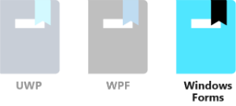
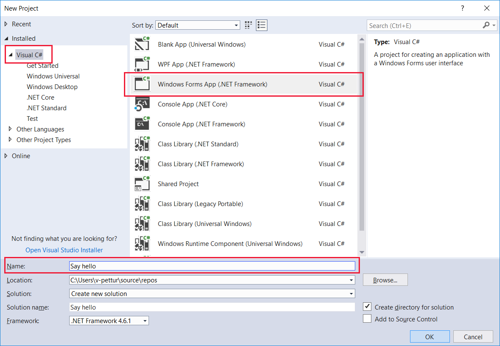
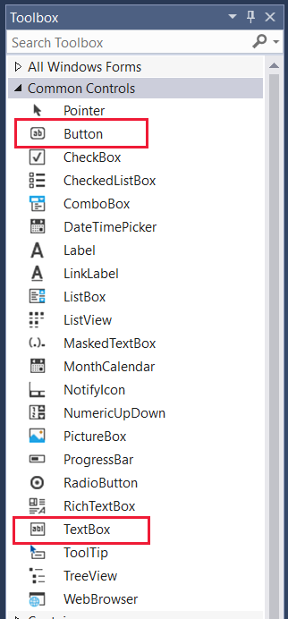
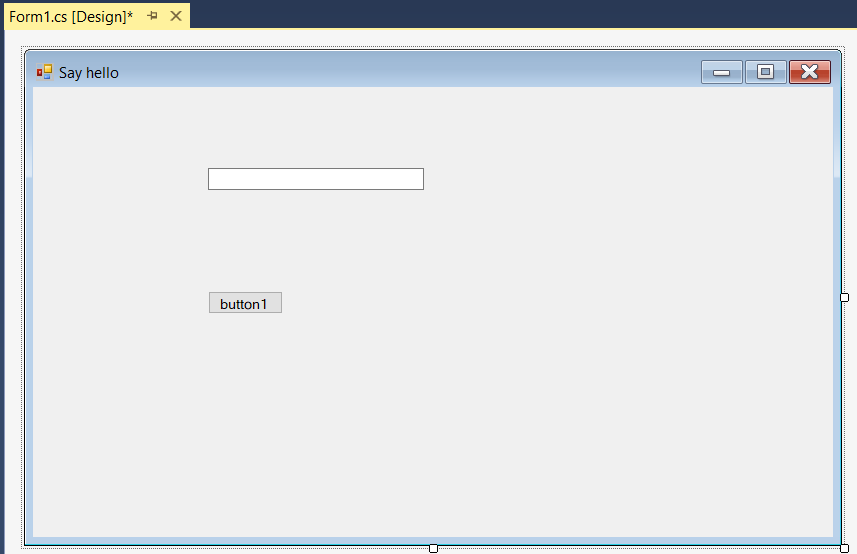
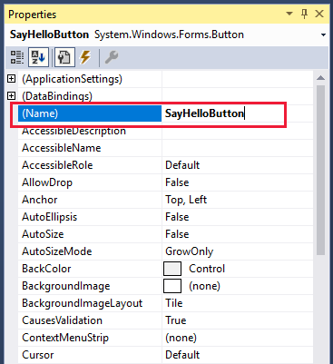
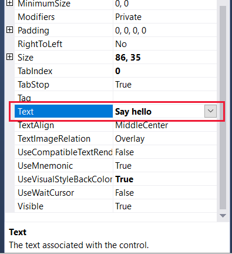
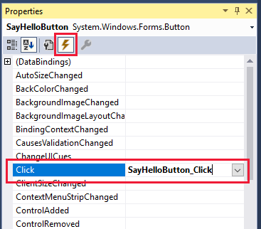
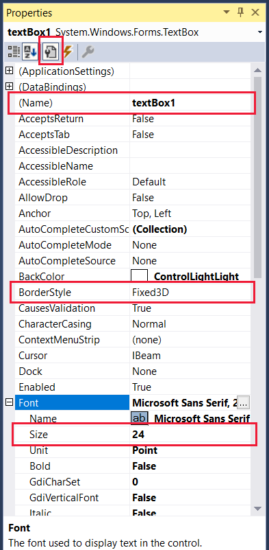
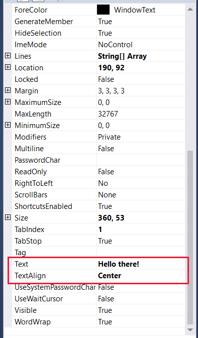
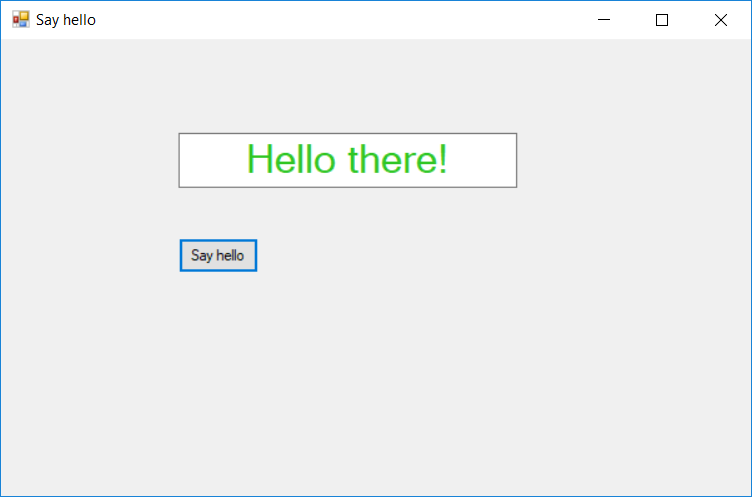

Windows Forms, based on the venerable Win32 API, is still a popular UI technology for developing many tools and utilities that just don't require anything fancy. Apps built with Windows Forms run on a Windows desktop, notebook, or tablet computer, and will have a familiar appearance to just about everybody that has used a computer.

In this unit, we will:
- Use Visual Studio to create a new Windows Forms project.
- Add UI and code elements to the project to create a fun variation of a "hello world" program. The "Hello there!" text will change color randomly each time the "Say hello" button is clicked.
- Learn how to set properties and create events.

> [!VIDEO https://www.microsoft.com/videoplayer/embed/RE2NNlQ]

> [!NOTE]
> We're assuming you have set up your computer with Windows 10 and Visual Studio, as detailed in the Learn Module "Introduction to Windows 10 development".

### Windows Forms "Say hello" tutorial

#### Create the project

1. Open Visual Studio, and select **File > New > Project** from the menus. Then with **Visual C#** selected as the project language, find and select **Windows Forms App (.NET Framework)** from the range of project options. Next change the **Name** to something friendly like **Say hello**, and select **OK** when you're ready.



2. By default the **Toolbox**, **Solution Explorer** and **Properties** panes should be open. If any are not, open them from the **View** menu. The **Toolbox** will be used first to add a button and a text box to the UI. Open up the **Common Controls** list of the **Toolbox**.



#### Build the UI

1. With the **Properties** pane for **Form1** open, change the **Text** entry from **Form1** to **Say hello**. From the other side of the screen, drag a **Button** from the Toolbox to the lower part of the layout, and a **TextBox** to the upper part. Then widen the text box a bit, so that your design looks similar to this.



2. Next, select the button to bring up its properties. Change the **Name** to **SayHelloButton**, then scroll down the properties and change the **Text** entry to **Say hello**.





3. A button needs to be associated with an event when it is clicked. This can be done either by selecting the button in the Design layout, or by selecting the event icon in **Properties** and then either typing return, or selecting the **Click** event entry. Do one of these (the event list method is shown below). Whichever method you choose, outline code for the event **SayHelloButton_Click** is added automatically to your .cs file, and that file will be opened. Take a quick look, then go back to the Design view for now, so we can set more UI properties.



4. Select the text box on the Design view to open up its properties. If you used the event method of adding the button event, you will need to select the central icon (shown below) in **Properties** to revert to the named list of properties for the UI element.  Leave the **Name** entry as **textBox1**, and change the font **Size** to **24** (select the "+" to the left of **Font** to expand the font properties), then scroll down the properties a bit and change **Text** to **Hello there!** and **TextAlign** to **Center**.




#### Add the code

1. Now, switch the main view so you are looking at Form1.cs.

```csharp
    public partial class Form1 : Form
    {
        public Form1()
        {
            InitializeComponent();
        }

        private void SayHelloButton_Click(object sender, EventArgs e)
        {

        }
    }
```

2. Let's make sure we have all the necessary **using** statements. Check that you have the following, and add them if you do not. You can optionally remove any unnecessary **using** statements Visual Studio included when it created the project (unused namespaces are faded to gray). Make sure not to remove the **System.Drawing** statement, as we'll need it soon.

```csharp
using System;
using System.Drawing;
using System.Windows.Forms;
```


3. In order to get random text colors to appear, we need to add a global variable **Random rand**. We need to initialize it in the **Form1** constructor method, and enter a method to fill a short byte array with random numbers. Copy and paste, or type in yourself, these lines from the code below.

```csharp
    public partial class Form1 : Form
    {
        Random rand;

        public Form1()
        {
            InitializeComponent();
            rand = new Random();
        }

        private byte[] GetRandomBytes(int n)
        {
            //  Fill an array of bytes of length "n" with random numbers.
            var randomBytes = new byte[n];
            rand.NextBytes(randomBytes);
            return randomBytes;
        }

        private void SayHelloButton_Click(object sender, EventArgs e)
        {

        }
    }
```

4. Finally, to change the text color each time the **Say hello** button is clicked, add the body of the **SayHelloButton_Click** method to your program.

```csharp
        private void SayHelloButton_Click(object sender, EventArgs e)
        {

            //  Declare an array of bytes, and fill it with random numbers
            byte[] rgb = GetRandomBytes(3);
            textBox1.ForeColor = Color.FromArgb(255, rgb[0], rgb[1], rgb[2]);
        }
```

5. Take a second or two to check over your code. If there is anything that has been underlined in red, then something isn't quite right. It could be a misspelled word or a piece of code in a place it shouldn't be.

#### Run!

Let's compile and run the program!

1. In Visual Studio, in the **Debug** menu, select **Start Without Debugging** (or **Start Debugging**, though we're not doing any debugging in this tutorial), or just press the F5 key. If everything has been entered correctly, you should see a running app very similar to the following.



2. After a few seconds of build time, click repeatedly on **Say hello** and watch the **Hello there!** text change color.

If you see this, well done! You have finished this tutorial. If not, carefully reexamine your code and UI properties settings for something that's gone amiss.
