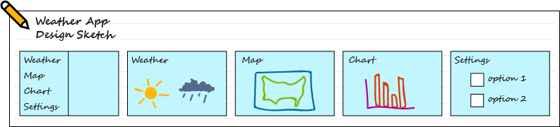
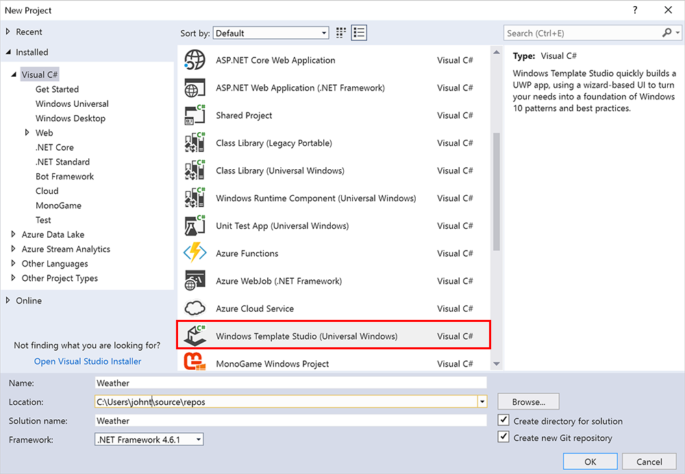
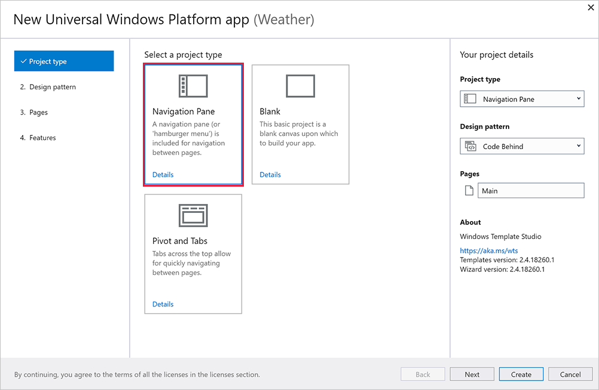
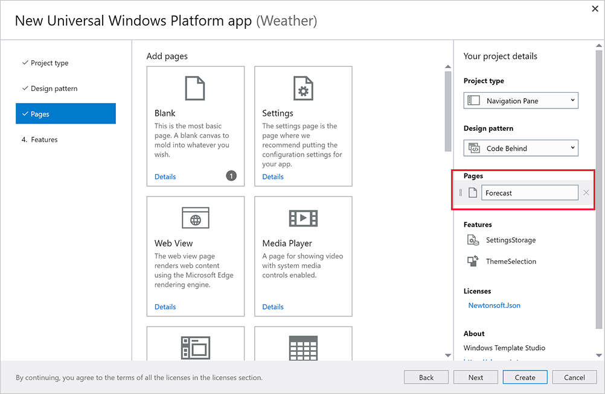
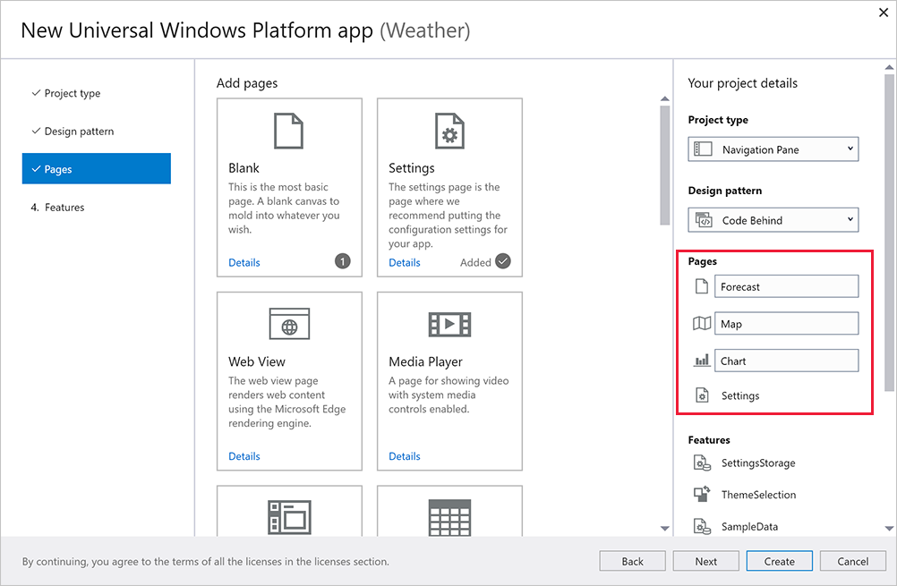
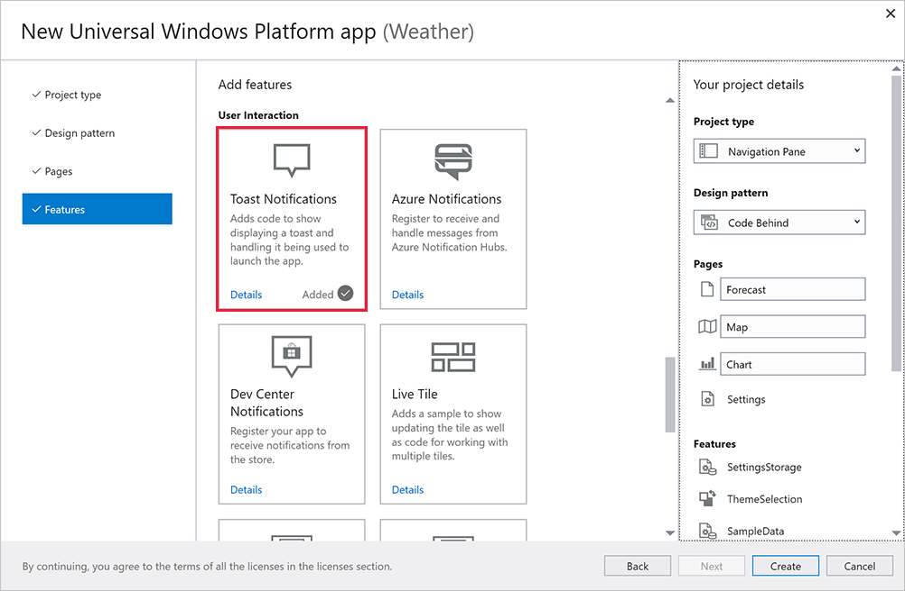
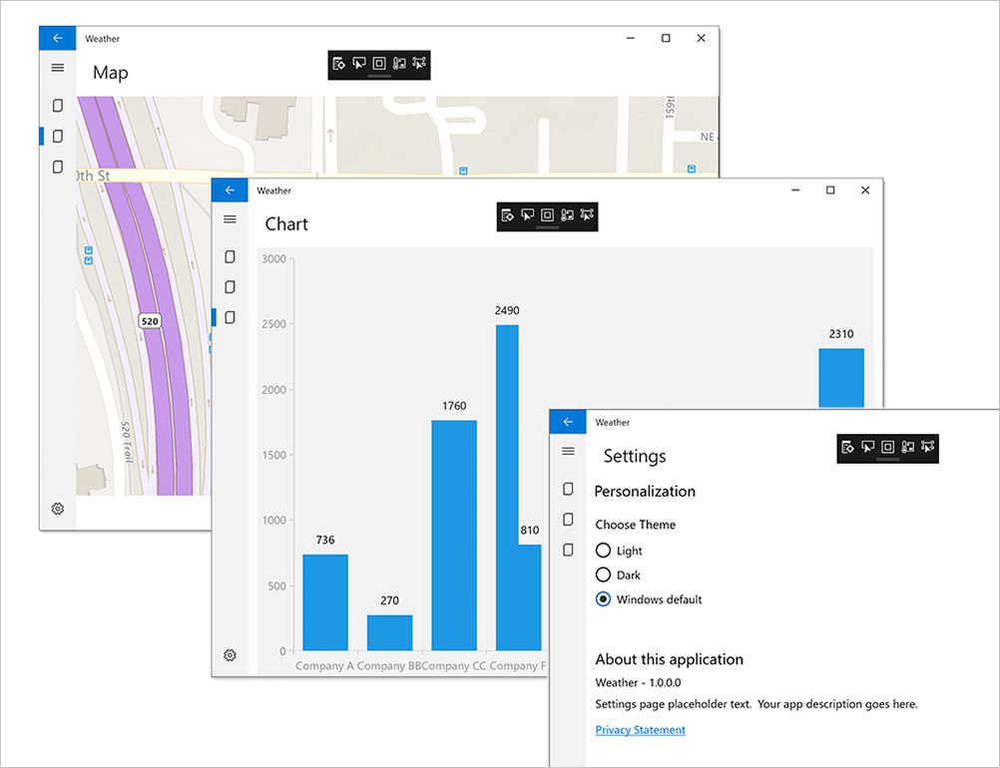

Windows Template Studio is a Visual Studio extension that accelerates the creation of new Universal Windows Platform (UWP) apps using a wizard-based experience. The resulting UWP project is well-formed, readable code that incorporates the latest Windows 10 features while implementing proven patterns and best practices.

## What can you do with Windows Template Studio?

Windows Template Studio does all the hard work of creating the code you would have to write manually every time you start writing a Windows 10 UWP app. As long as you have a clear idea of the structure of your app before you begin, you can use the wizard to go step-by-step through the process of adding features and views to your project. Once you're done, you can continue adding the code that implements the functionality that is unique to your particular project.

## Installing Windows Template Studio

If you used the installation script in "Installing tools automatically" module, then Windows Template Studio will be ready and waiting for you. If you need to install the tools yourself, go [to this Visual Studio extensions site](https://marketplace.visualstudio.com/items?itemName=WASTeamAccount.WindowsTemplateStudio) and select **Download**.

## Making an app with Windows Template Studio

Let's look at the process of creating a hypothetical app using Windows Template Studio. Feel free to follow along on your own computer.

First, let's sketch out what the app will look like when we're done. It can help to quite literally sketch on a piece of paper what features the app will have, and the way the views are interconnected. For this example, let's imagine we're building a weather forecast app. At the end of this tutorial, we're going to end up with the 'skeleton' of the app, ready for you to add the important weather-related features.

Here's the rough design drawing:

Our app is going to:

* Use the **Navigation View** control to switch between different views.
* Show weather symbols for the week on a blank page.
* Use a map view to show the current weather forecast area.
* Show a chart of previous weather data.
* Have a Settings page to let the user select options.
* Use notifications to warn the user of dangerous weather.

With these details decided, we're ready to use the Windows Template Studio wizard to create our project.

1. To launch the Windows Template Studio wizard, create a new project in Visual Studio by selecting **File > New  > Project**. You'll find Windows Template Studio under **Visual C#** as **Windows Template Studio (Universal Windows)***. 
    
1. Give your app the name **Weather**, and start the wizard process by selecting **OK**.
1. The Windows Template Studio wizard will open (it may need to update its templates first), and you'll see the following page. 
     
1. We begin by selecting a **Project type**. Make sure **Navigation Pane** is selected.
1. Skip over **Design pattern** (the default setting, **Code behind**, is fine). 
1. Select **Pages**. This is where things get interesting, as each of these page types can be added to your app. The page name and order can changed in the panel to the right. You'll see that a blank page called **Main** has been added by default. This is the page where will we draw our weather symbols, so change the name to **Forecast**. 
      
1. Now add a **Map** page, and then a **Chart** page and a **Settings** page. When you're done, your project should look like this.
       
1. The **Features** page is where you can add some more advanced Windows 10 features. For now we'll add **Toast Notifications**.
      
1. We're done! Select **Create** to generate your project.

Now that your project's code has been created, you can select **Run** or press **F5** to build and launch it.

You'll see that you already have quite an impressive app working. All you need to do is add the functionality. Easy!

## Next steps

That's where will we end our weather app. If you want to continue working on it, there are several online sources you can access to download weather data for specific locations: [here is a list](https://www.programmableweb.com/news/top-10-weather-apis/analysis/2014/11/13).
