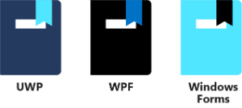

In this module, you learned how to create an app using UWP, WPF, and Windows Forms.

You then learned about Windows Template Studio, and used it to build the basic structure of an app.

If you think you're ready, it might be time to move onto creating a more complicated app. But first, take this quiz to test what you've learned:
